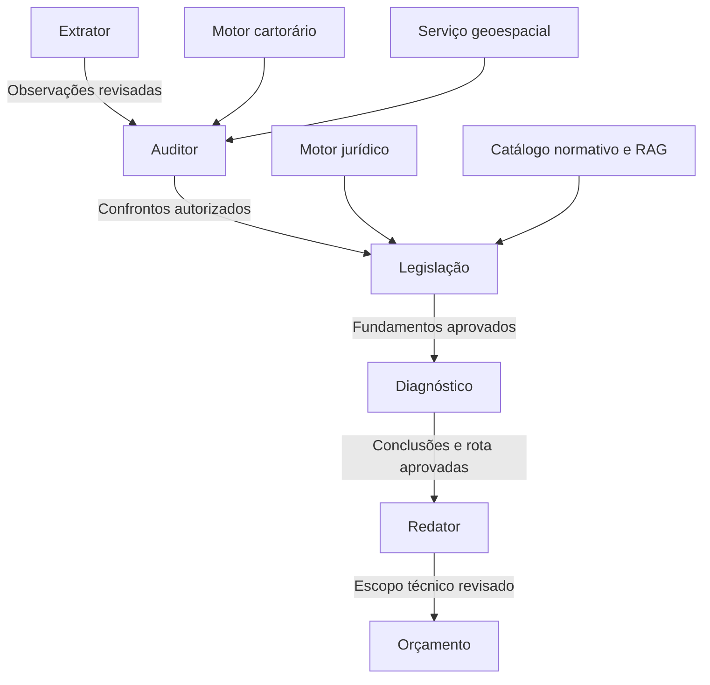

# Regente Ambiental — mergulho estrutural e desenho-alvo

**17/09/2026 · Análise para André e Ísis Terra · Sem implementação**

**Base do código:** `prosperidade/amigao`, main `d2a3de0070a456acb9095d063164135ae26cbe06` — PR #170. A contraprova foi consultada separadamente na branch `fix/contraprova-jobson-20260917`, commit `e30a8dd7296743d8ef545ce64962d957c9fd0a12`. As contenções dessa branch não são tratadas como comportamento da main.

## 1. Resposta central

**O Regente possui componentes aproveitáveis, mas ainda não possui uma cadeia decisória com contrato comum de evidência.** O caminho principal executa quatro agentes; o Redator e o Orçamento pertencem a outras chains. O extrator produz simultaneamente um resumo achatado e staging mais rico; consumidores diferentes usam representações diferentes; o orquestrador acumula dicionários de resultados e permite que insumos não revisados avancem. Não basta acrescentar skills, nem basta ligar os dicionários existentes. É necessário reconstruir o contrato de circulação e de revisão, preservando os serviços que já implementam partes corretas do domínio. **CONFIRMADO:** [app/agents/orchestrator.py:23–39](https://github.com/prosperidade/amigao/blob/d2a3de0070a456acb9095d063164135ae26cbe06/app/agents/orchestrator.py#L23-L39), [app/agents/orchestrator.py:162–202](https://github.com/prosperidade/amigao/blob/d2a3de0070a456acb9095d063164135ae26cbe06/app/agents/orchestrator.py#L162-L202), [app/agents/extrator.py:62–102](https://github.com/prosperidade/amigao/blob/d2a3de0070a456acb9095d063164135ae26cbe06/app/agents/extrator.py#L62-L102), [app/agents/auditor_imovel.py:60–89](https://github.com/prosperidade/amigao/blob/d2a3de0070a456acb9095d063164135ae26cbe06/app/agents/auditor_imovel.py#L60-L89).

**A recomendação é evoluir o sistema existente, como monólito modular, com seis agentes consumidores de um mesmo conjunto versionado de evidências, dois motores determinísticos e revisão persistida por conclusão.** Não recomendo trocar framework, banco, fila ou construir uma plataforma genérica de agentes. O patrimônio a preservar inclui observações registrais, reconciliação agrupada, consolidação humana, diagnósticos versionados, decisões por processo, Rota, geração comercial determinística e catálogo normativo com proveniência. **PROPOSTA**, apoiada nos componentes inventariados em [app/services/observacao_registral.py:442–721](https://github.com/prosperidade/amigao/blob/d2a3de0070a456acb9095d063164135ae26cbe06/app/services/observacao_registral.py#L442-L721), [app/services/reconciliation_decisions.py:958–991](https://github.com/prosperidade/amigao/blob/d2a3de0070a456acb9095d063164135ae26cbe06/app/services/reconciliation_decisions.py#L958-L991), [app/models/regulatory.py:184–223](https://github.com/prosperidade/amigao/blob/d2a3de0070a456acb9095d063164135ae26cbe06/app/models/regulatory.py#L184-L223), [app/models/regulatory.py:456–485](https://github.com/prosperidade/amigao/blob/d2a3de0070a456acb9095d063164135ae26cbe06/app/models/regulatory.py#L456-L485), [app/services/proposal_generator.py:191–297](https://github.com/prosperidade/amigao/blob/d2a3de0070a456acb9095d063164135ae26cbe06/app/services/proposal_generator.py#L191-L297) e [app/services/mirante_documents.py:423](https://github.com/prosperidade/amigao/blob/d2a3de0070a456acb9095d063164135ae26cbe06/app/services/mirante_documents.py#L423).

O primeiro resultado a construir deve ser **um percurso conectado que conserva fonte, desconhecimento e decisão até o orçamento**, ainda capaz de dizer “insuficiente”. Não deve ser outro agente isoladamente convincente. A liberação decisória exige depois o percurso real, com os documentos originais, as regras homologadas e a revisão da Ísis. Uma execução tecnicamente concluída não satisfaz esse aceite: hoje até uma chain interrompida para revisão pode emitir evento `completed`, e o worker verifica o sucesso dos passos retornados, não a execução de todos os passos previstos. **CONFIRMADO:** [app/agents/orchestrator.py:204–221](https://github.com/prosperidade/amigao/blob/d2a3de0070a456acb9095d063164135ae26cbe06/app/agents/orchestrator.py#L204-L221), [app/workers/agent_tasks.py:193–225](https://github.com/prosperidade/amigao/blob/d2a3de0070a456acb9095d063164135ae26cbe06/app/workers/agent_tasks.py#L193-L225).

### 1.1 Grau de evidência e limites

| Marcação | Significado neste documento |
|---|---|
| **CONFIRMADO** | Implementação ou declaração documental aberta e conferida no snapshot identificado. Não significa execução em produção. |
| **OBSERVADO PELA ÍSIS / RELATADO EM AUDITORIA** | Resultado recebido, atribuído à sua fonte; não foi reproduzido neste mergulho. |
| **HIPÓTESE** | Explicação possível do caso concreto, ainda dependente de dados de execução. |
| **PROPOSTA** | Contrato ou comportamento a construir; não é descrição do sistema atual. |

Esta rodada não executou agentes, testes, migrations, consultas a banco ou chamadas a modelos. Não alterou código, branch, PR, dívida ou produção. Os resultados de execução da contraprova anterior continuam sendo evidências daquela rodada, com seus limites, e não testes novos: [docs/auditoria/CONTRAPROVA_JOBSON_2026-09-17.md:23–39](https://github.com/prosperidade/amigao/blob/e30a8dd7296743d8ef545ce64962d957c9fd0a12/docs/auditoria/CONTRAPROVA_JOBSON_2026-09-17.md#L23-L39) **[branch da contraprova]**.

Foram consultados a trilha de auditorias, decisões arquiteturais, manifesto, dívidas e código dos caminhos descritos. A especificação v0.1 está no repositório. Os dois DOCX fornecidos são fontes de produto; referências a eles usam seção/ID, pois Word não tem linhas estáveis. A segunda verificação reprova a cadeia para uso decisório e deixa a nova Conferência pendente de reteste — não autoriza declarar que a Conferência nova já foi reprovada ou aprovada. **Fonte:** `02_REGENTE_IA_Segunda_Verificacao_Jobson_2026-09-17.docx`, §§1.3, 10.1 e “Resultado de produto”; também [docs/auditoria/CONTRAPROVA_JOBSON_2026-09-17.md:105–109](https://github.com/prosperidade/amigao/blob/e30a8dd7296743d8ef545ce64962d957c9fd0a12/docs/auditoria/CONTRAPROVA_JOBSON_2026-09-17.md#L105-L109) **[branch]**.

**Insumos externos não localizados nesta sessão:** as oito matrizes originais, a matriz cartorária, o protocolo completo de conflito de esferas, os 102 termos de referência, os indeferimentos, o processo SEI e os roteiros SIGCAR. Os números 325 regras / 159 abas / 14.056 linhas provêm do pedido e do rascunho, não de contagem independente dos arquivos. Portanto, este documento entrega o desenho de importação, execução e verificação, mas não certifica a tradução nem a correção jurídica de 325 regras que não foram inspecionadas. O exemplo disponível e as pendências de normalização estão em [docs/adr/ADR-042-motor-de-regras-deterministico-RASCUNHO.md:12–40](https://github.com/prosperidade/amigao/blob/d2a3de0070a456acb9095d063164135ae26cbe06/docs/adr/ADR-042-motor-de-regras-deterministico-RASCUNHO.md#L12-L40) e [docs/adr/ADR-042-motor-de-regras-deterministico-RASCUNHO.md:109–119](https://github.com/prosperidade/amigao/blob/d2a3de0070a456acb9095d063164135ae26cbe06/docs/adr/ADR-042-motor-de-regras-deterministico-RASCUNHO.md#L109-L119).

Também não estão disponíveis os PDFs e o KMZ originais do caso #25. A área aproximada e o comportamento das telas são observações da avaliação, não medições novas. A ausência desses insumos limita a homologação do conteúdo e do caso real; não impede identificar os contratos quebrados no código.

### 1.2 Premissas corrigidas antes do desenho

| Premissa recebida | Resultado da conferência |
|---|---|
| “Ninguém abriu o orquestrador.” | Não é sustentada pela trilha. A auditoria anterior já documentava a circulação, exceções de revisão, falhas jurídicas e idempotência. O problema demonstrável é a falta de fechamento dos contratos, não ausência histórica de leitura. [docs/auditoria/AUDITORIA_CODEX_11ab1af.md:817–1003](https://github.com/prosperidade/amigao/blob/d2a3de0070a456acb9095d063164135ae26cbe06/docs/auditoria/AUDITORIA_CODEX_11ab1af.md#L817-L1003). |
| “ADR-042 nunca commitado.” | O rascunho está versionado no snapshot da main usado aqui. Continua **não aceito**, conforme seu status. [docs/adr/ADR-042-motor-de-regras-deterministico-RASCUNHO.md:1–5](https://github.com/prosperidade/amigao/blob/d2a3de0070a456acb9095d063164135ae26cbe06/docs/adr/ADR-042-motor-de-regras-deterministico-RASCUNHO.md#L1-L5). |
| “Nenhuma skill real jamais executou em produção.” | Não é possível provar isso sem os registros de execução. Há caminho síncrono que deriva UF; as portas assíncronas examinadas não fazem o mesmo. A omissão é demonstrável nesses caminhos, não em toda execução histórica. [app/api/v1/agents.py:44–80](https://github.com/prosperidade/amigao/blob/d2a3de0070a456acb9095d063164135ae26cbe06/app/api/v1/agents.py#L44-L80), [app/api/v1/agents.py:192–228](https://github.com/prosperidade/amigao/blob/d2a3de0070a456acb9095d063164135ae26cbe06/app/api/v1/agents.py#L192-L228), [app/workers/agent_tasks.py:181–188](https://github.com/prosperidade/amigao/blob/d2a3de0070a456acb9095d063164135ae26cbe06/app/workers/agent_tasks.py#L181-L188). |
| “Legislação não recebe nada do caso.” | Não recebe diretamente o resultado do extrator/auditor na montagem básica, mas lê processo, imóvel e contexto persistido de passivos. É contexto incompleto e desigual, não ausência total. [app/agents/legislacao.py:106–156](https://github.com/prosperidade/amigao/blob/d2a3de0070a456acb9095d063164135ae26cbe06/app/agents/legislacao.py#L106-L156), [app/agents/legislacao.py:533–570](https://github.com/prosperidade/amigao/blob/d2a3de0070a456acb9095d063164135ae26cbe06/app/agents/legislacao.py#L533-L570). |
| “Escritura, certidão e contrato caem todos em matrícula.” | O prompt de preview reúne matrícula/escritura, mas o classificador distingue contratos. A taxonomia é insuficiente; a generalização para todo contrato é incorreta. O trajeto específico da escritura de Jobson depende do original e do job. [app/services/document_extractor.py:32–55](https://github.com/prosperidade/amigao/blob/d2a3de0070a456acb9095d063164135ae26cbe06/app/services/document_extractor.py#L32-L55), [app/services/ficha01_extraction.py:150–157](https://github.com/prosperidade/amigao/blob/d2a3de0070a456acb9095d063164135ae26cbe06/app/services/ficha01_extraction.py#L150-L157), [app/services/ficha01_extraction.py:234–249](https://github.com/prosperidade/amigao/blob/d2a3de0070a456acb9095d063164135ae26cbe06/app/services/ficha01_extraction.py#L234-L249). |
| “MACROETAPA_AGENTS sem consumidor.” | Falso no snapshot: é lido por `get_stage_agents`, exposto no status e usado no painel. É metadado de apresentação; não controla execução. [app/models/macroetapa.py:247–281](https://github.com/prosperidade/amigao/blob/d2a3de0070a456acb9095d063164135ae26cbe06/app/models/macroetapa.py#L247-L281), [app/services/macroetapa_engine.py:605–616](https://github.com/prosperidade/amigao/blob/d2a3de0070a456acb9095d063164135ae26cbe06/app/services/macroetapa_engine.py#L605-L616), [frontend/src/pages/Processes/WorkspaceRightPanel.tsx:193–194](https://github.com/prosperidade/amigao/blob/d2a3de0070a456acb9095d063164135ae26cbe06/frontend/src/pages/Processes/WorkspaceRightPanel.tsx#L193-L194). |
| “Não há representação de pessoas/temporalidade.” | Já existem representante de cliente e papéis adquirente/transmitente por ato. Falta o modelo geral de participação e de validade da representação. [app/models/client_representative.py:33–80](https://github.com/prosperidade/amigao/blob/d2a3de0070a456acb9095d063164135ae26cbe06/app/models/client_representative.py#L33-L80), [app/services/observacao_registral.py:672–721](https://github.com/prosperidade/amigao/blob/d2a3de0070a456acb9095d063164135ae26cbe06/app/services/observacao_registral.py#L672-L721). |
| “Property.geom nunca foi gravado.” | Não foi encontrado caminho de leitura de polígono, cálculo e gravação pelo fluxo examinado. Isso não prova o histórico de todas as linhas do banco. A coluna existe; o módulo geoespacial só identifica formatos. [app/models/property.py:30](https://github.com/prosperidade/amigao/blob/d2a3de0070a456acb9095d063164135ae26cbe06/app/models/property.py#L30), [app/services/geo_files.py:1–94](https://github.com/prosperidade/amigao/blob/d2a3de0070a456acb9095d063164135ae26cbe06/app/services/geo_files.py#L1-L94), [app/services/property_audit.py:344–352](https://github.com/prosperidade/amigao/blob/d2a3de0070a456acb9095d063164135ae26cbe06/app/services/property_audit.py#L344-L352). |

## 2. M1 — cadeia e contrato entre camadas

### 2.1 Fluxo real, portas de entrada e produtos

Há duas portas relevantes: a tela de agentes envia `metadata={}`; o botão da macroetapa monta descrição, tipo e urgência, mas não UF nem o `stage` esperado pela skill. O worker monta o contexto com esses metadados. A API síncrona tem enriquecimento próprio. Logo, o significado disponível a um agente depende da porta utilizada. **CONFIRMADO:** [frontend/src/pages/AI/AgentsPage.tsx:103–125](https://github.com/prosperidade/amigao/blob/d2a3de0070a456acb9095d063164135ae26cbe06/frontend/src/pages/AI/AgentsPage.tsx#L103-L125), [app/api/v1/processes.py:1135–1141](https://github.com/prosperidade/amigao/blob/d2a3de0070a456acb9095d063164135ae26cbe06/app/api/v1/processes.py#L1135-L1141), [app/workers/agent_tasks.py:181–188](https://github.com/prosperidade/amigao/blob/d2a3de0070a456acb9095d063164135ae26cbe06/app/workers/agent_tasks.py#L181-L188), [app/api/v1/agents.py:44–80](https://github.com/prosperidade/amigao/blob/d2a3de0070a456acb9095d063164135ae26cbe06/app/api/v1/agents.py#L44-L80).

| Componente | O que recebe hoje | O que produz/persiste | Ruptura relevante |
|---|---|---|---|
| **Extrator** | Texto/documento ou documentos com texto do processo. | Preview agregado em `extracted_fields`; relação de documentos com contagem; staging em percurso adicional; fatos específicos de auto de infração. | O primeiro valor não vazio de cada chave vence entre documentos. A relação `documents` não conserva qual documento forneceu cada valor agregado. Preview e staging são extrações distintas. [app/agents/extrator.py:44–102](https://github.com/prosperidade/amigao/blob/d2a3de0070a456acb9095d063164135ae26cbe06/app/agents/extrator.py#L44-L102). |
| **Auditor** | Property e documentos persistidos; dicionário inteiro do extrator; staging consultado separadamente. | Findings, RegulatoryIssue, matriz, resumo e atualizações de status no staging. | Regras e matriz trabalham com representações diferentes; resumo conta findings, não todas as linhas da matriz. [app/agents/auditor_imovel.py:60–139](https://github.com/prosperidade/amigao/blob/d2a3de0070a456acb9095d063164135ae26cbe06/app/agents/auditor_imovel.py#L60-L139), [app/agents/auditor_imovel.py:154–175](https://github.com/prosperidade/amigao/blob/d2a3de0070a456acb9095d063164135ae26cbe06/app/agents/auditor_imovel.py#L154-L175). |
| **Legislação** | Query/metadados, `atendimento` da chain se houver, processo/imóvel do banco, corpus e passivos persistidos. | Conteúdo regulatório, fontes e chunks referenciados; resultado no AIJob. | `atendimento` não integra `diagnostico_completo`; não há entrada explícita das observações e confrontos recém-produzidos. Existe enriquecimento pelo banco, sem contrato comum de evidências. [app/agents/orchestrator.py:32](https://github.com/prosperidade/amigao/blob/d2a3de0070a456acb9095d063164135ae26cbe06/app/agents/orchestrator.py#L32), [app/agents/legislacao.py:106–156](https://github.com/prosperidade/amigao/blob/d2a3de0070a456acb9095d063164135ae26cbe06/app/agents/legislacao.py#L106-L156), [app/agents/legislacao.py:245–261](https://github.com/prosperidade/amigao/blob/d2a3de0070a456acb9095d063164135ae26cbe06/app/agents/legislacao.py#L245-L261), [app/agents/legislacao.py:533–570](https://github.com/prosperidade/amigao/blob/d2a3de0070a456acb9095d063164135ae26cbe06/app/agents/legislacao.py#L533-L570). |
| **Diagnóstico** | Processo/imóvel, trechos documentais, resultados extrator/legal/auditor; busca jobs anteriores quando faltam resultados na chain. | Diagnóstico tipado mais aliases antigos; afirmações, riscos e revisão requerida. | “Job completed mais recente” não significa conclusão revisada nem snapshot compatível. Findings são convertidos em riscos; evidência vira string. [app/agents/diagnostico.py:164–235](https://github.com/prosperidade/amigao/blob/d2a3de0070a456acb9095d063164135ae26cbe06/app/agents/diagnostico.py#L164-L235), [app/agents/diagnostico.py:859–891](https://github.com/prosperidade/amigao/blob/d2a3de0070a456acb9095d063164135ae26cbe06/app/agents/diagnostico.py#L859-L891), [app/agents/diagnostico.py:1421–1524](https://github.com/prosperidade/amigao/blob/d2a3de0070a456acb9095d063164135ae26cbe06/app/agents/diagnostico.py#L1421-L1524). |
| **Redator** | Diagnóstico e legislação da chain, ou contexto básico do processo; pessoa/imóvel via metadata. | Peça tipada, citações e revisão requerida. | A chain dedicada contém só o Redator. Falta garantia de receber a versão aprovada dos produtos anteriores; fonte manual genérica satisfaz o fallback de fontes. [app/agents/orchestrator.py:34](https://github.com/prosperidade/amigao/blob/d2a3de0070a456acb9095d063164135ae26cbe06/app/agents/orchestrator.py#L34), [app/agents/redator.py:59–123](https://github.com/prosperidade/amigao/blob/d2a3de0070a456acb9095d063164135ae26cbe06/app/agents/redator.py#L59-L123), [app/agents/redator.py:129–160](https://github.com/prosperidade/amigao/blob/d2a3de0070a456acb9095d063164135ae26cbe06/app/agents/redator.py#L129-L160). |
| **Orçamento** | Diagnóstico/metadados e dados básicos do processo. | Estimativa por demanda; se houver IA, permite alterar escopo, faixa e prazo. | É caminho paralelo à proposta oficial que já nasce da Rota validada. [app/agents/orcamento.py:29–76](https://github.com/prosperidade/amigao/blob/d2a3de0070a456acb9095d063164135ae26cbe06/app/agents/orcamento.py#L29-L76), [app/agents/orcamento.py:95–138](https://github.com/prosperidade/amigao/blob/d2a3de0070a456acb9095d063164135ae26cbe06/app/agents/orcamento.py#L95-L138), [app/services/proposal_generator.py:191–270](https://github.com/prosperidade/amigao/blob/d2a3de0070a456acb9095d063164135ae26cbe06/app/services/proposal_generator.py#L191-L270). |

**Há um bloqueio concreto na ligação comercial:** `gerar_proposta = [diagnostico, orcamento]`; diagnóstico sempre retorna `requires_review=True`; ele não é exceção não bloqueante. Com `stop_on_review=True`, o orçamento não é alcançado quando esse diagnóstico termina normalmente. Desligar o flag remove a parada, mas não produz aprovação humana. **CONFIRMADO:** [app/agents/orchestrator.py:33](https://github.com/prosperidade/amigao/blob/d2a3de0070a456acb9095d063164135ae26cbe06/app/agents/orchestrator.py#L33), [app/agents/orchestrator.py:53–64](https://github.com/prosperidade/amigao/blob/d2a3de0070a456acb9095d063164135ae26cbe06/app/agents/orchestrator.py#L53-L64), [app/agents/orchestrator.py:187–202](https://github.com/prosperidade/amigao/blob/d2a3de0070a456acb9095d063164135ae26cbe06/app/agents/orchestrator.py#L187-L202), [app/agents/diagnostico.py:1393–1403](https://github.com/prosperidade/amigao/blob/d2a3de0070a456acb9095d063164135ae26cbe06/app/agents/diagnostico.py#L1393-L1403), [frontend/src/pages/AI/AgentsPage.tsx:119–125](https://github.com/prosperidade/amigao/blob/d2a3de0070a456acb9095d063164135ae26cbe06/frontend/src/pages/AI/AgentsPage.tsx#L119-L125).

### 2.2 As rupturas que um adaptador de dicionário não resolve

1. **Envelope e vocabulário incompatíveis.** O auditor procura `car_area_ha`, `ccir_area_ha` e `itr_area_ha` no primeiro nível. O extrator retorna `extracted_fields`; os prompts CAR/CCIR também usam `area_total_ha`. Desembrulhar o envelope não recupera a fonte perdida nem separa áreas homônimas. Três confrontos dependem de CCIR/ITR que o carregador de Property não fornece. Isso vale para essa bateria; a matriz de staging é outro caminho e pode fazer confrontos. [app/services/property_audit.py:247–265](https://github.com/prosperidade/amigao/blob/d2a3de0070a456acb9095d063164135ae26cbe06/app/services/property_audit.py#L247-L265), [app/agents/auditor_imovel.py:274–295](https://github.com/prosperidade/amigao/blob/d2a3de0070a456acb9095d063164135ae26cbe06/app/agents/auditor_imovel.py#L274-L295), [app/services/document_extractor.py:59–90](https://github.com/prosperidade/amigao/blob/d2a3de0070a456acb9095d063164135ae26cbe06/app/services/document_extractor.py#L59-L90), [app/agents/extrator.py:86–94](https://github.com/prosperidade/amigao/blob/d2a3de0070a456acb9095d063164135ae26cbe06/app/agents/extrator.py#L86-L94).
2. **A segunda fonte pode desaparecer na persistência.** Quando há `process_id`, a deduplicação considera tenant + tipo documental + processo; a chave contém campo, hint e valor, sem `document_id`. Dois documentos do mesmo tipo no mesmo caso podem ter a segunda observação idêntica suprimida. A condição está confirmada no código; não foi reproduzida aqui com banco. **Mesmo valor não significa mesma evidência.** [app/services/ficha01_extraction.py:1461–1485](https://github.com/prosperidade/amigao/blob/d2a3de0070a456acb9095d063164135ae26cbe06/app/services/ficha01_extraction.py#L1461-L1485).
3. **Diagnóstico sem espaço efetivo para a lacuna.** O schema tem `lacunas`, mas o construtor preenche uma lista vazia; cria também um risco de síntese a partir do texto e de uma severidade normalizada, com default médio. A lacuna não ganha a estrutura exigida pelo produto apenas por existir no schema. [app/agents/diagnostico.py:1340–1386](https://github.com/prosperidade/amigao/blob/d2a3de0070a456acb9095d063164135ae26cbe06/app/agents/diagnostico.py#L1340-L1386), [app/schemas/stage_output.py:340–348](https://github.com/prosperidade/amigao/blob/d2a3de0070a456acb9095d063164135ae26cbe06/app/schemas/stage_output.py#L340-L348).
4. **Confiança misturada a gravidade.** A base deriva confiança inversamente de `risco_estimado` quando não há `confidence`: risco baixo → confiança alta. Um risco baixo mal documentado pode ganhar confiança alta por construção. São dimensões independentes. [app/agents/base.py:567–580](https://github.com/prosperidade/amigao/blob/d2a3de0070a456acb9095d063164135ae26cbe06/app/agents/base.py#L567-L580).
5. **Ausência embutida como default.** `Property.has_embargo` tem default falso; o schema de criação também. O diagnóstico e a legislação recebem esse booleano sem comprovante de consulta junto ao campo. Isso é vetor estrutural de DIAG-005; não prova que foi a única causa da frase de Jobson. [app/models/property.py:32](https://github.com/prosperidade/amigao/blob/d2a3de0070a456acb9095d063164135ae26cbe06/app/models/property.py#L32), [app/schemas/property.py:19](https://github.com/prosperidade/amigao/blob/d2a3de0070a456acb9095d063164135ae26cbe06/app/schemas/property.py#L19), [app/agents/diagnostico.py:378–386](https://github.com/prosperidade/amigao/blob/d2a3de0070a456acb9095d063164135ae26cbe06/app/agents/diagnostico.py#L378-L386), [app/agents/legislacao.py:554–562](https://github.com/prosperidade/amigao/blob/d2a3de0070a456acb9095d063164135ae26cbe06/app/agents/legislacao.py#L554-L562).
6. **Rastreabilidade textual não garante sustentação.** Fontes de afirmações podem ser associadas por sobreposição de palavras ≥0,6; o avaliador de citação casa tipo, número e ano da norma. Esses mecanismos não demonstram que o trecho suporta aquela afirmação nem que a norma se aplica ao fato. [app/agents/diagnostico.py:1238–1302](https://github.com/prosperidade/amigao/blob/d2a3de0070a456acb9095d063164135ae26cbe06/app/agents/diagnostico.py#L1238-L1302), [app/services/citation_evaluator.py:303–364](https://github.com/prosperidade/amigao/blob/d2a3de0070a456acb9095d063164135ae26cbe06/app/services/citation_evaluator.py#L303-L364).

### 2.3 Contrato-alvo: evidência, observação, derivação e conclusão

**PROPOSTA.** Não chamar todo output de “evidência”. Adotar quatro objetos lógicos, com identidades e versões próprias:

| Objeto | O que significa | Exemplo permitido | O que não pode acontecer |
|---|---|---|---|
| **Fonte/evidência primária** | Documento original ou registro de consulta identificável, íntegro e localizável. | Escritura, página e trecho; resposta oficial consultada para determinada pessoa/imóvel e data. | Um AIJob ser apresentado como documento comprobatório do fato. |
| **Observação** | Extração ou anotação do que a fonte declara. Pode estar errada e precisa de verificação. | “Este trecho identifica X como comprador na escritura datada de Y.” | Virar “X é titular atual” sem as premissas adicionais. |
| **Derivação determinística** | Cálculo ou regra com entradas referenciadas e versão do método. | Área calculada da geometria; diferença entre duas áreas; resultado de regra. | Apagar as entradas ou se apresentar como evidência primária independente. |
| **Conclusão** | Interpretação ou decisão proposta, sustentada por observações, derivações, normas e/ou conclusões aprovadas. | “Há divergência a reconciliar”; “aplicabilidade não determinada”. | Ser promovida a fato documental por ter sido produzida por outro agente. |

Este contrato amplia, em vez de apagar, `SourceRef` e `Afirmacao`, que hoje já distinguem documento, matriz, auditor, legislação, atendimento e ausência de fonte, mas não exigem todos os vínculos abaixo: [app/schemas/stage_output.py:126–168](https://github.com/prosperidade/amigao/blob/d2a3de0070a456acb9095d063164135ae26cbe06/app/schemas/stage_output.py#L126-L168).

**Campos mínimos de uma observação/evidência referenciada:**

| Grupo | Campos e obrigação proposta |
|---|---|
| Identidade | ID, versão, tenant, vínculos com caso e objeto; tipo de origem: documento, declaração humana, consulta externa ou derivação. |
| Documento | ID da versão do documento, hash do original e do texto utilizado, classificação documental revisável, emissor e data de emissão quando conhecidos. |
| Localização | Página e trecho/posição; bounding box quando disponível. Para texto sem página, posição no texto versionado; para KMZ, arquivo interno e identificador da feição. Localização desconhecida fica explícita, nunca inventada. |
| Significado | Predicado/campo tipado, valor literal, valor normalizado, unidade, sujeito e objeto. “Área da RL” não é “área do imóvel”. |
| Pessoa/papel | ID da pessoa mencionada, papel naquele documento/ato e vínculo com o caso. CPF encontrado não define cliente, proprietário ou representante. |
| Tempo | Data do documento, data do ato, intervalo de eficácia declarado, data de referência da análise e estado derivado de vigência. Datas desconhecidas permanecem desconhecidas. |
| Qualidade | Método/modelo de extração, cobertura de leitura, âncora, certeza da extração e estado de revisão. Não confundir confiança do modelo com força documental ou certeza jurídica. |
| Linhagem | Origem, execução, observações anteriores substituídas, dependências de qualquer cálculo. Original e correções permanecem recuperáveis. |

**Campos mínimos de conclusão:** ID/versão; classe (`fato_documental`, `divergencia`, `lacuna`, `hipotese`, `risco`, `orientacao`, `escopo_proposto`); texto; premissas por ID; normas/dispositivos e regras por versão; aplicabilidade e justificativa; certeza; impacto; urgência com fundamento temporal; limites; estado de revisão; autor/revisor; data; dependências e versão substituída. Conclusão de risco exige fato e teste de aplicabilidade; serviço proposto exige finalidade e decisão de escopo — uma lacuna pode justificar uma atividade de verificação, mas não comprova irregularidade.

**Envelope comum de execução:** caso/tenant/objetivo/data de referência; snapshot dos documentos e observações autorizadas; derivações reproduzíveis; conclusões aprovadas; lacunas e falhas explícitas; regras/skills/templates selecionados; tarefas ainda não avaliáveis. Outputs acrescentam observações ou conclusões identificadas. Não devolvem um novo “estado verdadeiro do caso” independente do repositório canônico.

### 2.4 “Não sei”, “não existe” e “não se aplica”

**PROPOSTA — estados de conhecimento diferentes dos estados de execução:**

| Estado | Requisito de uso | Exemplo de redação |
|---|---|---|
| Não determinado | Dados insuficientes, leitura parcial, fonte inadequada ou conflito não resolvido. | “A titularidade atual não foi determinada pelos documentos disponíveis.” |
| Não localizado no material examinado | Escopo de busca identificado e cobertura declarada. | “Não foi localizada referência a embargo nestes documentos.” |
| Ausência verificada no escopo | Consulta apropriada, identificadores consultados, data, resposta preservada e limites da fonte. | “A consulta X, realizada em Y para Z, não retornou registro; resultado limitado a essa base e momento.” |
| Não aplicável | Regra de aplicabilidade avaliada com premissas suficientes, ou decisão profissional explícita com fundamento. | “Esta exigência não se aplica ao ato/objetivo avaliado, pelas condições registradas.” |
| Conflitante | Fontes ou regras sustentam respostas incompatíveis. | “Há duas declarações incompatíveis; requer decisão.” |
| Falha de verificação | Consulta, storage, OCR ou cálculo falhou. | “A verificação não foi concluída por erro de leitura/consulta.” |

“Não apresentou documento”, “declarou não possuir”, “dispensado” e “aguardando obtenção” são estados de atendimento ao requisito, não prova de inexistência do fato. O lifecycle existente é aproveitável, mas seu enum não contém declaração de não posse: [app/services/document_lifecycle.py:47–60](https://github.com/prosperidade/amigao/blob/d2a3de0070a456acb9095d063164135ae26cbe06/app/services/document_lifecycle.py#L47-L60). A declaração deve registrar pessoa, autor do registro, data e escopo, separada da dispensa profissional.

### 2.5 Gate humano que permite continuidade sem autoconfirmação

**PROPOSTA:** revisar a **conclusão e sua versão**, não apenas o job inteiro. Aprovar, corrigir, rejeitar e marcar não aplicável devem persistir autor, justificativa, versão e premissas. Corrigir cria nova versão; rejeitar não apaga a observação ou o documento. “Não aplicável” precisa de fundamento e não é atalho para “não quero tratar”.

O gate fica na **montagem do contexto seguinte**, antes da chamada. Apenas conclusões aprovadas e ainda válidas entram como premissas. Observações e documentos continuam disponíveis com sua qualificação de origem; conclusões rejeitadas permanecem no histórico, sem alimentar diagnóstico, escopo ou preço. Uma execução posterior não pode recuperar “o último job completed” e contornar a decisão.

O radar continua: leitura, cálculo, recuperação normativa e identificação de lacunas independentes podem prosseguir. Uma conclusão dependente de item pendente fica “aguardando revisão”; o restante não precisa parar. Não se deve permitir um “diagnóstico preliminar” consumir a conclusão pendente por outro campo, pois isso recriaria o contorno do gate. A unidade de retomada é o conjunto de dependências liberadas, não uma lista reiniciada do zero.

**Revisão não transforma falsidade em verdade.** O consultor pode assumir responsabilidade por uma hipótese, registrar ressalva e orientar coleta; o sistema conserva esse estatuto. Não pode aprovar “ausência verificada” sem registro de verificação, nem converter uma escritura em certidão atual apenas porque houve aceite.

O mecanismo requer execução persistida com snapshot, passos esperados/concluídos/pendentes/falhos, cursor de retomada e chave idempotente. Aceite e evento de retomada devem ser transacionalmente coerentes; tentativas concorrentes não podem duplicar conclusão ou consumir revisão antiga. Reaproveitar Celery para executar trabalho e AIJob para registrar chamadas; não usar o status de AIJob como toda a máquina de revisão.

**Mudança deliberada de ADR:** o ADR-011 hoje permite consumir findings não validados e admite legislação parcial. REVIEW-001 altera essa autorização. Deve-se registrar essa substituição quando houver implementação; não descrever o comportamento atual como simples descumprimento do ADR. Já há validação de diagnóstico e decisão sobre issues críticas, mas não equivalem à revisão intermediária de toda conclusão. [docs/adr/011-agentes-nao-bloqueantes-chain.md:26–58](https://github.com/prosperidade/amigao/blob/d2a3de0070a456acb9095d063164135ae26cbe06/docs/adr/011-agentes-nao-bloqueantes-chain.md#L26-L58), [app/api/v1/regulatory.py:374–475](https://github.com/prosperidade/amigao/blob/d2a3de0070a456acb9095d063164135ae26cbe06/app/api/v1/regulatory.py#L374-L475), [app/models/regulatory.py:456–485](https://github.com/prosperidade/amigao/blob/d2a3de0070a456acb9095d063164135ae26cbe06/app/models/regulatory.py#L456-L485).

### 2.6 O que se aproveita e o que muda

| Peça existente | Aproveitar | Evolução necessária |
|---|---|---|
| `SourceRef` / `Afirmacao` | Vocabulário de fontes e apresentação da rastreabilidade. | IDs verificáveis de evidência e conclusão, versão, posição, papel, tempo, aplicabilidade e revisão. Não aceitar tipo `auditor` como fonte primária. [app/schemas/stage_output.py:126–168](https://github.com/prosperidade/amigao/blob/d2a3de0070a456acb9095d063164135ae26cbe06/app/schemas/stage_output.py#L126-L168). |
| `StageOutputContent` | Validação estrutural e artefatos por tipo. | Validar referências e requisitos semânticos por classe; lista de fontes não vazia não prova suporte. [app/schemas/stage_output.py:269–296](https://github.com/prosperidade/amigao/blob/d2a3de0070a456acb9095d063164135ae26cbe06/app/schemas/stage_output.py#L269-L296). |
| Observação tipada | Tipos de ato, atributos, distinção de objetos e alterações explícitas. | Evidência durável e identidade entre documentos; taxonomia também para escritura/contrato/pessoa. [app/services/observacao_registral.py:442–505](https://github.com/prosperidade/amigao/blob/d2a3de0070a456acb9095d063164135ae26cbe06/app/services/observacao_registral.py#L442-L505), [app/models/extracted_field_staging.py:93–100](https://github.com/prosperidade/amigao/blob/d2a3de0070a456acb9095d063164135ae26cbe06/app/models/extracted_field_staging.py#L93-L100). |
| Vigência derivada | Funções puras, data de referência, baixas/aditivos. | Qualificar completude e autoridade da fonte; distinguir “último no documento” de “situação atual”. [app/services/observacao_registral.py:587–721](https://github.com/prosperidade/amigao/blob/d2a3de0070a456acb9095d063164135ae26cbe06/app/services/observacao_registral.py#L587-L721). |
| Âncora no texto | Posição, trecho e método já existentes. | Prender ao hash/versão do texto e página; conferir papel e contexto, não só existência dos dígitos. [app/services/text_anchor.py:52–66](https://github.com/prosperidade/amigao/blob/d2a3de0070a456acb9095d063164135ae26cbe06/app/services/text_anchor.py#L52-L66). |
| Conferência agrupada | Projeção por decisões e comparações numéricas. | Persistir a decisão/revisão sobre o conjunto versionado; não usar dedup de campo para eliminar fonte. [app/services/reconciliation_decisions.py:174–245](https://github.com/prosperidade/amigao/blob/d2a3de0070a456acb9095d063164135ae26cbe06/app/services/reconciliation_decisions.py#L174-L245), [app/services/reconciliation_decisions.py:958–991](https://github.com/prosperidade/amigao/blob/d2a3de0070a456acb9095d063164135ae26cbe06/app/services/reconciliation_decisions.py#L958-L991). |
| Invalidação por aviso | Preservar artefatos e trabalho humano; indicar nova evidência. | Dependências exatas por versão para impedir consumo de conclusão superada. O aviso temporal atual não é snapshot de execução. [app/services/artifact_staleness.py:178–228](https://github.com/prosperidade/amigao/blob/d2a3de0070a456acb9095d063164135ae26cbe06/app/services/artifact_staleness.py#L178-L228). |

## 3. M2 — os seis agentes e o método de domínio

### 3.1 Responsabilidades no desenho-alvo

**PROPOSTA.** “Agente” identifica uma responsabilidade do fluxo, não obriga uma chamada LLM. Nenhum dos seis cria evidência primária por escrever uma resposta.

| Agente | Decisão/produto permitido | Entrada necessária | Produção rastreável | Skill de domínio × prompt |
|---|---|---|---|---|
| **Extrator** | Propor classificação e observações; declarar ilegibilidade/insuficiência. | Original, texto/páginas versionados, taxonomia, sujeitos candidatos e objetivo. | Observações com âncoras, papéis, datas, unidades e cobertura. Para geometria, chama serviço determinístico. | Skill: como reconhecer documentos e atos, preservar ambiguidades e separar pessoas/áreas. Prompt: instruções de extração e schema para aquele tipo/janela. Não decide domínio atual. |
| **Auditor** | Comparar fontes e executar confrontos; classificar fato isolado, concordância, divergência e lacuna. | Observações revisadas ou qualificadas, objetos identificados, resultados cartorários e geométricos. | Cálculos, pares comparados, regra/versão, lacunas e conclusões propostas. | Método da skill vira regras e critérios verificáveis. O núcleo permanece sem LLM. Não precisa de prompt para subtrair áreas. |
| **Legislação** | Selecionar fundamentos aplicáveis e explicar relação fato–norma–consequência. | Objetivo canônico, UF/competência/datas, fatos e confrontos autorizados, avaliações dos motores, corpus curado. | Fundamentos por ID de norma/dispositivo/versão; aplicabilidade, conflito ou insuficiência explícitos. | Skill: ordem de pesquisa, competência, exceções, limites e tratamento de fontes. Prompt: tarefa e formato; não armazena sozinho as regras obrigatórias. |
| **Diagnóstico** | Sintetizar situação, hipóteses, lacunas, riscos sustentados e próximos passos. | Evidências e conclusões permitidas, avaliações jurídicas, limitações de cobertura. | Conclusões revisáveis com premissas; risco separado de certeza e urgência. | Skill: raciocínio da Ísis, ordem de perguntas, distinções e forma de explicar. Prompt: tarefa do estágio e schema. Não reexecuta arbitrariamente contas nem transforma lacuna em passivo. |
| **Redator** | Elaborar peça técnica e descrição do escopo tecnicamente fundamentado. | Diagnóstico/rota aprovados, evidências citáveis e TR/template pertinente versionado. | Rascunho com afirmações ligadas a fontes e checklist de atendimento ao TR. | Skill: método da peça e revisão; TR: exigências documentais específicas. Prompt: organização/redação. Não inventa levantamento, ART, protocolo ou consulta. |
| **Orçamento** | Propor esforço, preço e condições para escopo validado. | Rota/itens aprovados, especificação técnica do Redator quando pertinente, tabela comercial versionada e parâmetros do tenant. | Itens com origem, quantidades, cálculo, faixa, premissas e revisão comercial. | Skill: dimensionar trabalho e explicitar exclusões. Prompt: eventual justificativa/sugestão. Totais e restrições comerciais são determinísticos. |

O orçamento atual e a proposta oficial divergem justamente na origem do escopo: um inventa uma lista por demanda, a outra lê passos faturáveis de Rota validada. A integração deve tomar a segunda como autoridade comercial, usando o agente como assistente do mesmo serviço, não como segunda fonte. [app/agents/orcamento.py:95–138](https://github.com/prosperidade/amigao/blob/d2a3de0070a456acb9095d063164135ae26cbe06/app/agents/orcamento.py#L95-L138), [app/services/proposal_generator.py:213–270](https://github.com/prosperidade/amigao/blob/d2a3de0070a456acb9095d063164135ae26cbe06/app/services/proposal_generator.py#L213-L270), [docs/adr/028-proposta-nasce-da-rota.md:25–39](https://github.com/prosperidade/amigao/blob/d2a3de0070a456acb9095d063164135ae26cbe06/docs/adr/028-proposta-nasce-da-rota.md#L25-L39).

### 3.2 As skills existentes cabem? Sim, como material de domínio a reconciliar

O inventário contém quatro `SKILL.md`: dois templates e dois métodos reais. Não existem seis métodos operacionais só porque há seis classes. O extrator usa serviços para chamar modelos; o auditor não chama LLM; a injeção automática acontece em `BaseAgent.call_llm`. **CONFIRMADO:** [app/skills/extrator/_template/SKILL.md:1–18](https://github.com/prosperidade/amigao/blob/d2a3de0070a456acb9095d063164135ae26cbe06/app/skills/extrator/_template/SKILL.md#L1-L18), [app/skills/redator/_template/SKILL.md:1–17](https://github.com/prosperidade/amigao/blob/d2a3de0070a456acb9095d063164135ae26cbe06/app/skills/redator/_template/SKILL.md#L1-L17), [app/agents/extrator.py:62–83](https://github.com/prosperidade/amigao/blob/d2a3de0070a456acb9095d063164135ae26cbe06/app/agents/extrator.py#L62-L83), [app/agents/auditor_imovel.py:54–74](https://github.com/prosperidade/amigao/blob/d2a3de0070a456acb9095d063164135ae26cbe06/app/agents/auditor_imovel.py#L54-L74), [app/agents/base.py:293–313](https://github.com/prosperidade/amigao/blob/d2a3de0070a456acb9095d063164135ae26cbe06/app/agents/base.py#L293-L313).

| Material | Reaproveitamento | O que não copiar literalmente |
|---|---|---|
| Diagnóstico, 890 linhas, UF GO/MS/MT | Método de perguntas, distinção entre preliminar/consolidado/saneamento, lacunas, áreas com finalidades distintas, cautela sobre verificações externas. | A H1 classifica “não sei se há GEO” como risco alto e ausência como crítico; contradiz a orientação de registrar lacunas e a segunda validação. O texto descreve uma ordem de agentes antiga e schema diferente do atual. [app/skills/diagnostico/situacao_ambiental_imovel_rural/SKILL.md:16–47](https://github.com/prosperidade/amigao/blob/d2a3de0070a456acb9095d063164135ae26cbe06/app/skills/diagnostico/situacao_ambiental_imovel_rural/SKILL.md#L16-L47), [app/skills/diagnostico/situacao_ambiental_imovel_rural/SKILL.md:189–199](https://github.com/prosperidade/amigao/blob/d2a3de0070a456acb9095d063164135ae26cbe06/app/skills/diagnostico/situacao_ambiental_imovel_rural/SKILL.md#L189-L199), [app/skills/diagnostico/situacao_ambiental_imovel_rural/SKILL.md:336–340](https://github.com/prosperidade/amigao/blob/d2a3de0070a456acb9095d063164135ae26cbe06/app/skills/diagnostico/situacao_ambiental_imovel_rural/SKILL.md#L336-L340), [app/skills/diagnostico/situacao_ambiental_imovel_rural/SKILL.md:426](https://github.com/prosperidade/amigao/blob/d2a3de0070a456acb9095d063164135ae26cbe06/app/skills/diagnostico/situacao_ambiental_imovel_rural/SKILL.md#L426), [app/skills/diagnostico/situacao_ambiental_imovel_rural/SKILL.md:500–518](https://github.com/prosperidade/amigao/blob/d2a3de0070a456acb9095d063164135ae26cbe06/app/skills/diagnostico/situacao_ambiental_imovel_rural/SKILL.md#L500-L518); [app/schemas/stage_output.py:93–94](https://github.com/prosperidade/amigao/blob/d2a3de0070a456acb9095d063164135ae26cbe06/app/schemas/stage_output.py#L93-L94), [app/schemas/stage_output.py:340–348](https://github.com/prosperidade/amigao/blob/d2a3de0070a456acb9095d063164135ae26cbe06/app/schemas/stage_output.py#L340-L348). |
| Auditor, 228 linhas + anexo de 66 | Especificação de confrontos, classificação e critérios para testes e regras. Parte desse método já está implementada em `property_audit`. | Não adicionar LLM só para fazer o arquivo “rodar”. Faixas de triagem não viram tolerância legal universal; anexos não são automaticamente carregados pelo registry. [app/skills/auditor_imovel/analise_divergencias_documentais/SKILL.md:1–228](https://github.com/prosperidade/amigao/blob/d2a3de0070a456acb9095d063164135ae26cbe06/app/skills/auditor_imovel/analise_divergencias_documentais/SKILL.md#L1-L228), [app/skills/auditor_imovel/analise_divergencias_documentais/bases_car_estaduais.md:1–66](https://github.com/prosperidade/amigao/blob/d2a3de0070a456acb9095d063164135ae26cbe06/app/skills/auditor_imovel/analise_divergencias_documentais/bases_car_estaduais.md#L1-L66), [app/services/property_audit.py:50–75](https://github.com/prosperidade/amigao/blob/d2a3de0070a456acb9095d063164135ae26cbe06/app/services/property_audit.py#L50-L75), [app/skills/_registry.py:139–159](https://github.com/prosperidade/amigao/blob/d2a3de0070a456acb9095d063164135ae26cbe06/app/skills/_registry.py#L139-L159). |
| Extrator `_template` | Convenção de empacotamento. | Não é método real de leitura de certidão/escritura/CAR e não atende o contexto CAR pelos filtros template. [app/skills/extrator/_template/SKILL.md:1–18](https://github.com/prosperidade/amigao/blob/d2a3de0070a456acb9095d063164135ae26cbe06/app/skills/extrator/_template/SKILL.md#L1-L18). |
| Redator `_template` | Convenção de empacotamento. | Não comprova atendimento a ofício, PRAD, memorial ou TR. Os templates aceitos pelo agente são mais amplos que o conteúdo de skill disponível. [app/skills/redator/_template/SKILL.md:1–17](https://github.com/prosperidade/amigao/blob/d2a3de0070a456acb9095d063164135ae26cbe06/app/skills/redator/_template/SKILL.md#L1-L17), [app/agents/redator.py:45–50](https://github.com/prosperidade/amigao/blob/d2a3de0070a456acb9095d063164135ae26cbe06/app/agents/redator.py#L45-L50). |

**Não religar as 890 linhas sem revisão semântica.** Preservar autoria e rastrear cada regra/método migrado; substituir heurísticas incompatíveis com a avaliação mais recente por testes de aplicabilidade. Normas concretas e condições obrigatórias vão para catálogo/regras versionados; o método de investigação continua como skill. Essa separação já é intenção do ADR-006: [docs/adr/006-skills-procedurais.md:68–82](https://github.com/prosperidade/amigao/blob/d2a3de0070a456acb9095d063164135ae26cbe06/docs/adr/006-skills-procedurais.md#L68-L82).

### 3.3 Por que UF some e como corrigir o desenho

A skill exige `metadata.uf`. A seleção usa conjunção dos filtros e retorna falso quando o campo falta; o contexto carregado do imóvel dentro de outro dicionário não participa automaticamente. A composição então devolve só o prompt-base, e erros de descoberta/carregamento são convertidos em ausência de skill. **CONFIRMADO:** [app/skills/diagnostico/situacao_ambiental_imovel_rural/SKILL.md:1–11](https://github.com/prosperidade/amigao/blob/d2a3de0070a456acb9095d063164135ae26cbe06/app/skills/diagnostico/situacao_ambiental_imovel_rural/SKILL.md#L1-L11), [app/skills/_registry.py:229–253](https://github.com/prosperidade/amigao/blob/d2a3de0070a456acb9095d063164135ae26cbe06/app/skills/_registry.py#L229-L253), [app/agents/base.py:419–459](https://github.com/prosperidade/amigao/blob/d2a3de0070a456acb9095d063164135ae26cbe06/app/agents/base.py#L419-L459).

**Carregamento condicional é adequado; omissão silenciosa de método obrigatório é inadequada. PROPOSTA:**

- Um único construtor de contexto, no servidor, usado por tela, API síncrona, worker e retomada. UF vem de dado autorizado e normalizado; conflito entre cadastro e documento é registrado, não resolvido por precedência cega do payload.
- Skill-base obrigatória para cada responsabilidade LLM; extensões por documento, objetivo, UF e estágio. UF desconhecida permite método geral de coleta, mas não conclusão estadual disfarçada de cobertura nacional.
- Seleção retorna manifesto: skills aplicadas, versões/hashes, anexos incluídos, skills esperadas ausentes e motivo de exclusão. Método obrigatório indisponível gera estado visível de capacidade insuficiente.
- Precedência e compatibilidade explícitas. Hoje a promessa de especificidade está no frontmatter, mas o executor simplesmente anexa todas as correspondentes. Não supor que uma skill específica substitui a genérica. [app/skills/diagnostico/situacao_ambiental_imovel_rural/SKILL.md:9–11](https://github.com/prosperidade/amigao/blob/d2a3de0070a456acb9095d063164135ae26cbe06/app/skills/diagnostico/situacao_ambiental_imovel_rural/SKILL.md#L9-L11), [app/agents/base.py:438–467](https://github.com/prosperidade/amigao/blob/d2a3de0070a456acb9095d063164135ae26cbe06/app/agents/base.py#L438-L467).
- SP/MG presentes no acervo descrito não significam skill/corpus homologados; MS aparece na skill, mas não na lista de matrizes fornecida no pedido. Cobertura deve ser uma matriz real de capacidade por objetivo/UF/fonte, nunca inferida da existência de um arquivo.

### 3.4 Prompt montado e AIJob

**Não é aceitável para o produto pretendido não saber qual método foi usado.** AIJob já guarda resultado, bruto, modelo, provider, custo e trace; possui `input_payload`, mas a criação padrão do agente não o preenche e não grava prompt montado nem manifesto de skills. O manifesto promete rastrear dado, lei, prompt e modelo. [app/models/ai_job.py:60–76](https://github.com/prosperidade/amigao/blob/d2a3de0070a456acb9095d063164135ae26cbe06/app/models/ai_job.py#L60-L76), [app/agents/base.py:472–519](https://github.com/prosperidade/amigao/blob/d2a3de0070a456acb9095d063164135ae26cbe06/app/agents/base.py#L472-L519), [docs/manifesto/01-VISAO_PRODUTO.md:44](https://github.com/prosperidade/amigao/blob/d2a3de0070a456acb9095d063164135ae26cbe06/docs/manifesto/01-VISAO_PRODUTO.md#L44).

**PROPOSTA:** registrar cada chamada, inclusive chamadas internas do extrator, com contexto/snapshot, prompt-base e versão, system/user efetivamente enviados ou referência íntegra a objeto imutável, hashes, manifesto de skills e anexos, parâmetros efetivos, modelo/provider de cada tentativa, resposta bruta, parse, validação e custo. Hash sem conteúdo recuperável não basta. Não registrar credenciais nos prompts arquivados; aplicar o mesmo isolamento e acesso do caso. Auditar reprodução de entrada é possível; prometer a mesma resposta LLM byte a byte não é.

Fallbacks podem existir, mas precisam ser identificados. O fallback direto `_call_claude` da Legislação deve convergir para o gateway e o mesmo registro de contexto: hoje ele existe como caminho executável distinto. [app/agents/legislacao.py:222–235](https://github.com/prosperidade/amigao/blob/d2a3de0070a456acb9095d063164135ae26cbe06/app/agents/legislacao.py#L222-L235), [app/agents/legislacao.py:282–288](https://github.com/prosperidade/amigao/blob/d2a3de0070a456acb9095d063164135ae26cbe06/app/agents/legislacao.py#L282-L288), [docs/adr/002-multi-llm-gateway.md:22–28](https://github.com/prosperidade/amigao/blob/d2a3de0070a456acb9095d063164135ae26cbe06/docs/adr/002-multi-llm-gateway.md#L22-L28).

## 4. M3 — determinístico, LLM e os dois motores

### 4.1 A fronteira de responsabilidade

**PROPOSTA:** a divisão deve seguir a natureza da operação, não o nome da classe que hoje a executa.

| Operação | Responsável | Resultado auditável |
|---|---|---|
| Hash, formato, unidade, normalização numérica e identidade de versão | Código determinístico | Valor original/normalizado, método e falha explícita. |
| OCR e interpretação de linguagem documental | Parser/OCR/LLM conforme formato, seguido de validação | Texto e observações propostos, cobertura e âncoras. Não prova semântica perfeita. |
| Área, diferença, soma admissível e interseção | Serviço geoespacial/numérico determinístico | Entradas, unidade, CRS, método e resultado reproduzível. |
| Reconhecimento de pessoa e papel em texto ambíguo | Extração assistida + revisão | Participação proposta; nenhuma promoção por posição numa lista. |
| Aplicação de condição formalizada | Motor cartorário ou jurídico | Condições avaliadas, entradas faltantes, regra/versão e resultado. |
| Busca de dispositivo conhecido | Consulta por identidade normativa | Norma, versão, dispositivo e trecho exato. |
| Descoberta de material relacionado | RAG | Candidatos, com score de busca; não decisão de aplicabilidade. |
| Interpretação não formalizada, síntese e redação | LLM assistido por skill + decisão humana | Conclusão com premissas e limites, nunca fonte primária nova. |
| Aprovação, assunção de hipótese e escopo comercial | Profissional responsável | Decisão versionada e contextual ao caso. |

O auditor determinístico é uma escolha correta. O que precisa mudar é seu contrato e a correção de suas regras. Há regra que classifica ausência textual de GEO como crítica, e comparação de RL que espera campos não fornecidos pelo carregador do próprio auditor. Não é falta de inteligência generativa. [app/services/property_audit.py:296–341](https://github.com/prosperidade/amigao/blob/d2a3de0070a456acb9095d063164135ae26cbe06/app/services/property_audit.py#L296-L341), [app/agents/auditor_imovel.py:274–285](https://github.com/prosperidade/amigao/blob/d2a3de0070a456acb9095d063164135ae26cbe06/app/agents/auditor_imovel.py#L274-L285).

### 4.2 Motor cartorário

**PROPOSTA: serviço determinístico de qualificação documental e de estado registral segundo as evidências disponíveis.** Ele não lê livremente documentos por LLM nem garante a realidade externa por ausência de evento no material recebido.

**Entradas:** documentos classificados/revisados; identidade da serventia e matrícula; atos com referência interna; pessoas e papéis; datas; alterações/cancelamentos expressos; cobertura e data da certidão; objetivo e data de referência do caso; regras cartorárias homologadas.

**Operações:**

1. Determinar o que cada espécie documental pode sustentar. Escritura registra declarações/negócio no documento; não recebe automaticamente a autoridade atribuída à certidão atualizada exigida pela avaliação. Contrato comercial não vira ato registral.
2. Construir relações entre atos por referência explícita e identidade registral completa. `AV.10` sozinho não é identificador global; documento, matrícula e serventia delimitam o ato.
3. Derivar situações segundo a data de referência: baixado, alterado, expirado, vigente segundo o material examinado ou indeterminado. Manter evento de alteração e prova que o sustenta.
4. Propor cadeia dominial e participações, incluindo transmissões parciais, representação e sucessão quando as regras/evidências as permitirem. Não usar “último nome encontrado” como titular atual.
5. Declarar exatamente o que falta: certidão adequada, trecho legível, vínculo de aditivo, documento de representação, ato intermediário ou esclarecimento de fração/objeto.

**Saídas:** qualificações documentais, grafo de atos, estado derivado com limites, conflitos e conclusões propostas. Cada resultado carrega regra/versão, premissas e fonte; nenhum pode apagar a condição “segundo a certidão de data X”.

**Reuso concreto:** `aplicar_alteracoes`, `derivar_vigencia`, `cadeia_titularidade`, `titular_atual`, as observações tipadas e a linhagem de matrículas. **Limites confirmados:** a vigência pode ser marcada por mera presença de `data_ato`; `rl_vigente` não exclui estado indeterminado; `titular_atual` escolhe maior ordem entre transferências com adquirentes, sem provar completude da cadeia atual. Isso não torna as funções descartáveis, mas impede tratá-las como motor cartorário completo. [app/services/observacao_registral.py:442–499](https://github.com/prosperidade/amigao/blob/d2a3de0070a456acb9095d063164135ae26cbe06/app/services/observacao_registral.py#L442-L499), [app/services/observacao_registral.py:587–669](https://github.com/prosperidade/amigao/blob/d2a3de0070a456acb9095d063164135ae26cbe06/app/services/observacao_registral.py#L587-L669), [app/services/observacao_registral.py:697–721](https://github.com/prosperidade/amigao/blob/d2a3de0070a456acb9095d063164135ae26cbe06/app/services/observacao_registral.py#L697-L721), [docs/adr/027-vigencia-cadeia-de-fichas.md:29–59](https://github.com/prosperidade/amigao/blob/d2a3de0070a456acb9095d063164135ae26cbe06/docs/adr/027-vigencia-cadeia-de-fichas.md#L29-L59).

**Integração:** roda sobre observações qualificadas antes do confronto do Auditor; pode ser reavaliado após revisão ou documento novo. Legislação e Diagnóstico consultam seus resultados com a mesma linhagem. Sua regra depende de norma? A referência normativa é resolvida no catálogo compartilhado; não se copia legislação para dentro da implementação cartorária.

**Fronteira de validação:** sem a matriz cartorária original, não é possível afirmar quais condições de transmissão, ônus, sucessão e representação já estão formalizadas pela Ísis. O desenho acima define como recebê-las; o conteúdo exato permanece a homologar.

### 4.3 Motor jurídico

**PROPOSTA: avaliador de regras versionadas, com aplicabilidade explícita e trilha completa.** As 325 regras descritas não devem virar 325 trechos de prompt, nem 325 `if` espalhados nos agentes.

Cada regra precisa declarar:

- Identidade estável, versão, eixo e objetivo(s); UF/alcance territorial; competência e órgão quando relevantes; intervalo de vigência/aplicação e data de revisão.
- Predicados de entrada tipados: existência, valor, unidade, papel, tempo, classe documental, qualidade mínima da fonte e estado de revisão exigido.
- Condição formal executável; resultado; mensagem; consequências permitidas; severidade separada da certeza; necessidade de decisão profissional.
- Fonte normativa por chave **mais versão e dispositivo**; origem na planilha/aba/linha e hash do arquivo; autoria, homologação e histórico de publicação.
- Exemplos positivos, negativos, incompletos, conflitantes e de fronteira. Texto preenchido na coluna “condição lógica” não prova que ela já possa ser executada.

O runtime deve usar linguagem restrita de condições e operadores conhecidos, sem executar Python/SQL arbitrário importado. Uma regra que exige conceito ainda não representado deve ser recusada na publicação ou marcada como não executável, com motivo. Não aceitar um LLM traduzindo e ativando regras sem conferência.

**Estados de avaliação:** `aplicavel_disparou`, `aplicavel_nao_disparou`, `nao_aplicavel`, `indeterminado`, `conflito`, `erro_execucao`. Nas condições, tratar valor desconhecido como desconhecido, não como falso. O relatório lista também regras não avaliadas e suas entradas faltantes. “Zero regras disparadas” só pode significar isso; não significa regularidade.

**Aplicabilidade precede consequência.** A seleção considera objetivo, território, competência, ato e datas. Uma regra federal pode integrar um caso estadual; UF do imóvel não decide sozinha o órgão competente. Preservar a distinção já formalizada pelo ADR-034. [docs/adr/034-esfera-pelo-orgao-do-passivo.md:31–59](https://github.com/prosperidade/amigao/blob/d2a3de0070a456acb9095d063164135ae26cbe06/docs/adr/034-esfera-pelo-orgao-do-passivo.md#L31-L59), [app/agents/legislacao.py:337–345](https://github.com/prosperidade/amigao/blob/d2a3de0070a456acb9095d063164135ae26cbe06/app/agents/legislacao.py#L337-L345).

**Conflito de esferas:** o protocolo informado — Constituição, competência privativa, concorrente e contradição com norma geral — deve virar uma tabela de decisão homologada, com os pressupostos de cada ramo e referências normativas. Não implementar o atalho “federal sempre ganha”, nem “norma mais restritiva sempre ganha”. Quando competência, alcance ou exceção não estiverem suficientemente determinados, retornar conflito para decisão profissional. O texto completo do protocolo é insumo obrigatório para preencher essa tabela; não foi substituído por uma interpretação inventada neste documento.

**Integração com os agentes:**

- O Auditor disponibiliza confrontos e lacunas factuais; não atribui obrigação jurídica só pela ausência de campo.
- Legislação chama o motor jurídico com o snapshot; recupera os dispositivos indicados; pesquisa questões residuais; explica a fundamentação.
- Diagnóstico recebe avaliações autorizadas, não o texto legal agregado como licença para concluir qualquer coisa.
- O mesmo contrato funciona como pós-validação de conclusões: uma saída que afirma obrigação sem satisfazer a aplicabilidade é devolvida como não sustentada. Não se cria outro conjunto divergente de regras no pós-validador.

### 4.4 RAG, matrizes e acervo não são a mesma base

| Acervo informado | Função proposta | Controle de autoridade |
|---|---|---|
| Matrizes regulatórias e cartorárias | Autoria de regras e método. | Origem, versão, homologação e tradução formal rastreáveis. |
| Normas oficiais | Texto de fundamentação. | Identidade, dispositivo, versão, vigência/consulta e fonte. |
| 102 TRs IPE/SEMAD | Requisitos de composição e verificação das peças. | Órgão, tipo de peça, objetivo, versão e alcance. TR não substitui toda a análise de obrigação legal. |
| Indeferimentos reais | Casos exemplares e motivos de falha. | Preservar contexto; não generalizar uma decisão individual automaticamente. |
| Processo SEI com interpretação oficial | Material interpretativo qualificado. | Autoridade, objeto, alcance e data; não assumir aplicação universal pelo fato de ser oficial. |
| Roteiros SIGCAR por erro | Recuperação operacional por código/mensagem e versão do sistema. | Distinguir correção operacional de regra jurídica. |

O catálogo já oferece tipos de fonte, dispositivo, hash e metadados normativos. Reutilizá-lo, mantendo separação entre norma, interpretação, referência operacional e exemplo. Acurácia jurídica exige mais que similaridade e mais que match de identidade da lei. [app/models/knowledge_catalog.py:36–50](https://github.com/prosperidade/amigao/blob/d2a3de0070a456acb9095d063164135ae26cbe06/app/models/knowledge_catalog.py#L36-L50), [app/models/knowledge_catalog.py:91–131](https://github.com/prosperidade/amigao/blob/d2a3de0070a456acb9095d063164135ae26cbe06/app/models/knowledge_catalog.py#L91-L131), [app/models/legislation.py:87–118](https://github.com/prosperidade/amigao/blob/d2a3de0070a456acb9095d063164135ae26cbe06/app/models/legislation.py#L87-L118), [app/services/citation_evaluator.py:322–353](https://github.com/prosperidade/amigao/blob/d2a3de0070a456acb9095d063164135ae26cbe06/app/services/citation_evaluator.py#L322-L353).

**PROPOSTA para recuperação:** primeiro resolver as fontes exatas das regras acionadas; depois buscar questões residuais em corpus filtrado. Se for necessário ampliar a busca para diagnosticar falta de tags/cobertura, esses resultados permanecem candidatos até serem qualificados. Não relaxar silenciosamente UF/objetivo e apresentar o material como aplicável. O fallback atual relaxa filtros e captura exceções da busca; isso precisa ser visível como operação degradada. [app/agents/legislacao.py:316–374](https://github.com/prosperidade/amigao/blob/d2a3de0070a456acb9095d063164135ae26cbe06/app/agents/legislacao.py#L316-L374).

A integridade do cartão normativo deve vir de um registro único: título, número, órgão, dispositivo, texto e URL resolvidos por IDs, e não recompostos de fragmentos independentes escritos pelo LLM. O vínculo regra→norma não pode ser apenas `Art. 29`: requer identidade da norma, versão e dispositivo. O `dispositivo` existente é parte da chave, não a identidade inteira.

### 4.5 Julgamento do ADR-042

**Aprovo a direção; não aprovo o rascunho como contrato pronto para implementação.**

| Ponto | Veredito e ajuste |
|---|---|
| Motor fora do RAG | Correto. Regra formal não depende de recall semântico para disparar. [docs/adr/ADR-042-motor-de-regras-deterministico-RASCUNHO.md:44–57](https://github.com/prosperidade/amigao/blob/d2a3de0070a456acb9095d063164135ae26cbe06/docs/adr/ADR-042-motor-de-regras-deterministico-RASCUNHO.md#L44-L57). |
| Planilha como autoria, tabela versionada como execução | Correto e central para autonomia da Ísis. Acrescentar validação, homologação, ativação e rollback de versão. [docs/adr/ADR-042-motor-de-regras-deterministico-RASCUNHO.md:59–65](https://github.com/prosperidade/amigao/blob/d2a3de0070a456acb9095d063164135ae26cbe06/docs/adr/ADR-042-motor-de-regras-deterministico-RASCUNHO.md#L59-L65). |
| Chave normativa + dispositivo | Correto, mas falta versão/identidade completa e tratamento de fonte não resolvida. [docs/adr/ADR-042-motor-de-regras-deterministico-RASCUNHO.md:40](https://github.com/prosperidade/amigao/blob/d2a3de0070a456acb9095d063164135ae26cbe06/docs/adr/ADR-042-motor-de-regras-deterministico-RASCUNHO.md#L40), [docs/adr/ADR-042-motor-de-regras-deterministico-RASCUNHO.md:57](https://github.com/prosperidade/amigao/blob/d2a3de0070a456acb9095d063164135ae26cbe06/docs/adr/ADR-042-motor-de-regras-deterministico-RASCUNHO.md#L57). |
| “Disparou / não disparou” | Insuficiente. Não distingue falso, desconhecido, não aplicável, conflito e erro. [docs/adr/ADR-042-motor-de-regras-deterministico-RASCUNHO.md:48–55](https://github.com/prosperidade/amigao/blob/d2a3de0070a456acb9095d063164135ae26cbe06/docs/adr/ADR-042-motor-de-regras-deterministico-RASCUNHO.md#L48-L55). |
| “O motor decide” | Aceitável para avaliar condições; inadequado para decisão profissional final. Separar resultado computacional, conclusão proposta e revisão. [docs/adr/ADR-042-motor-de-regras-deterministico-RASCUNHO.md:57–71](https://github.com/prosperidade/amigao/blob/d2a3de0070a456acb9095d063164135ae26cbe06/docs/adr/ADR-042-motor-de-regras-deterministico-RASCUNHO.md#L57-L71). |
| “Propõe e para, conforme ADR-011” | Contradição: o ADR-011 autoriza continuidade com insumos não revisados. REVIEW-001 precisa de contrato novo explícito. [docs/adr/ADR-042-motor-de-regras-deterministico-RASCUNHO.md:70](https://github.com/prosperidade/amigao/blob/d2a3de0070a456acb9095d063164135ae26cbe06/docs/adr/ADR-042-motor-de-regras-deterministico-RASCUNHO.md#L70), [docs/adr/011-agentes-nao-bloqueantes-chain.md:28–32](https://github.com/prosperidade/amigao/blob/d2a3de0070a456acb9095d063164135ae26cbe06/docs/adr/011-agentes-nao-bloqueantes-chain.md#L28-L32). |
| “Custo zero”, “auditoria trivial”, falha apenas como não disparo | Não procede como garantia de sistema. Não há custo de token na avaliação, mas há importação, curadoria, execução, dados e manutenção. Uma condição errada pode disparar incorretamente; entradas estocásticas não viram verdade por passar num motor determinístico. [docs/adr/ADR-042-motor-de-regras-deterministico-RASCUNHO.md:54–55](https://github.com/prosperidade/amigao/blob/d2a3de0070a456acb9095d063164135ae26cbe06/docs/adr/ADR-042-motor-de-regras-deterministico-RASCUNHO.md#L54-L55), [docs/adr/ADR-042-motor-de-regras-deterministico-RASCUNHO.md:87–94](https://github.com/prosperidade/amigao/blob/d2a3de0070a456acb9095d063164135ae26cbe06/docs/adr/ADR-042-motor-de-regras-deterministico-RASCUNHO.md#L87-L94). |
| “Cobertura de cinco UFs de uma vez” | Presença declarada de regras não prova cobertura operacional, fontes resolvidas ou casos homologados. Precisa de inventário de capacidade e testes por objetivo/UF. [docs/adr/ADR-042-motor-de-regras-deterministico-RASCUNHO.md:88–89](https://github.com/prosperidade/amigao/blob/d2a3de0070a456acb9095d063164135ae26cbe06/docs/adr/ADR-042-motor-de-regras-deterministico-RASCUNHO.md#L88-L89). |
| Pendências de vocabulário e colunas deslocadas | São bloqueios reais de importação, não detalhes editoriais. Não decidir sinônimos por suposição. [docs/adr/ADR-042-motor-de-regras-deterministico-RASCUNHO.md:111–119](https://github.com/prosperidade/amigao/blob/d2a3de0070a456acb9095d063164135ae26cbe06/docs/adr/ADR-042-motor-de-regras-deterministico-RASCUNHO.md#L111-L119). |

**Dois motores não exigem duas infraestruturas. PROPOSTA:** módulos cartorário e jurídico com catálogo, versionamento, avaliação e trilha compartilhados, cada qual com predicados e resultados de domínio próprios. PostGIS, parsing, aritmética e precificação continuam serviços determinísticos; não viram agentes extras nem um terceiro motor regulatório.

## 5. M4 — modelo de dados e migração

### 5.1 O modelo atual suporta o quê?

| Dimensão | Estado confirmado | Consequência para o desenho |
|---|---|---|
| Documento e proveniência básica | Documento possui storage key, checksum, tipo, versão, origem e texto. O vínculo ao processo usa CASCADE. [app/models/document.py:35–60](https://github.com/prosperidade/amigao/blob/d2a3de0070a456acb9095d063164135ae26cbe06/app/models/document.py#L35-L60), [app/models/document.py:86–94](https://github.com/prosperidade/amigao/blob/d2a3de0070a456acb9095d063164135ae26cbe06/app/models/document.py#L86-L94). | Reusar arquivo/documento; criar preservação efetiva de versões e fragmentos. Um número de versão isolado não garante histórico imutável de texto/OCR. |
| Observação | Staging possui documento, campo/valor, destino, tipo de observação, atributos, decisão e carimbo de consolidação. [app/models/extracted_field_staging.py:46–140](https://github.com/prosperidade/amigao/blob/d2a3de0070a456acb9095d063164135ae26cbe06/app/models/extracted_field_staging.py#L46-L140). | É material rico, mas sua identidade e ciclo são de campo candidato à escrita. Não deve continuar como único repositório de prova durável. |
| Afirmação | `Afirmacao` é schema de conteúdo, com texto/categoria/fontes. [app/schemas/stage_output.py:161–168](https://github.com/prosperidade/amigao/blob/d2a3de0070a456acb9095d063164135ae26cbe06/app/schemas/stage_output.py#L161-L168). | Evoluir para conclusão identificável e versionada, com revisão e premissas verificáveis. Não confundir um objeto JSON com inexistência total de modelagem. |
| Pessoas | Client distingue cadastro; representante possui CPF, papel e documento-fonte; proprietário na matrícula é JSON. [app/models/client_representative.py:47–80](https://github.com/prosperidade/amigao/blob/d2a3de0070a456acb9095d063164135ae26cbe06/app/models/client_representative.py#L47-L80), [app/models/matricula.py:90](https://github.com/prosperidade/amigao/blob/d2a3de0070a456acb9095d063164135ae26cbe06/app/models/matricula.py#L90), [app/models/client.py:75–97](https://github.com/prosperidade/amigao/blob/d2a3de0070a456acb9095d063164135ae26cbe06/app/models/client.py#L75-L97). | Reutilizar identidades e índices; generalizar participação no caso/ato. Cliente contratante, titular e representante são relações diferentes. |
| Temporalidade | Atos têm atributos e derivações; matrícula possui linhagem/histórico. [app/services/observacao_registral.py:587–721](https://github.com/prosperidade/amigao/blob/d2a3de0070a456acb9095d063164135ae26cbe06/app/services/observacao_registral.py#L587-L721), [docs/adr/027-vigencia-cadeia-de-fichas.md:31–39](https://github.com/prosperidade/amigao/blob/d2a3de0070a456acb9095d063164135ae26cbe06/docs/adr/027-vigencia-cadeia-de-fichas.md#L31-L39). | Não recomeçar do zero. Acrescentar identidade entre fontes, intervalos, autoridade e completude documental. |
| Geometria | Coluna existe em SRID 4674; upload geoespacial apenas é reconhecido. [app/models/property.py:30](https://github.com/prosperidade/amigao/blob/d2a3de0070a456acb9095d063164135ae26cbe06/app/models/property.py#L30), [app/services/geo_files.py:61–94](https://github.com/prosperidade/amigao/blob/d2a3de0070a456acb9095d063164135ae26cbe06/app/services/geo_files.py#L61-L94). | Falta o percurso de ingestão, versão, cálculo e comparação. A coluna não é implementação espacial. |
| Áreas por finalidade | Há áreas documental, gráfica, APP e agora RL numérica. [app/models/property.py:49–69](https://github.com/prosperidade/amigao/blob/d2a3de0070a456acb9095d063164135ae26cbe06/app/models/property.py#L49-L69). | Reusar projeções; conservar medições por fonte e objeto antes de escolher valores canônicos. |
| Revisão | Diagnóstico versionado, validação de artefato, ProcessDecision e ProcessIssueDecision. [app/models/regulatory.py:184–223](https://github.com/prosperidade/amigao/blob/d2a3de0070a456acb9095d063164135ae26cbe06/app/models/regulatory.py#L184-L223), [app/models/stage_output.py:56–74](https://github.com/prosperidade/amigao/blob/d2a3de0070a456acb9095d063164135ae26cbe06/app/models/stage_output.py#L56-L74), [app/models/process_decision.py:71–124](https://github.com/prosperidade/amigao/blob/d2a3de0070a456acb9095d063164135ae26cbe06/app/models/process_decision.py#L71-L124), [app/models/regulatory.py:456–485](https://github.com/prosperidade/amigao/blob/d2a3de0070a456acb9095d063164135ae26cbe06/app/models/regulatory.py#L456-L485). | Reutilizar UX e semântica de responsabilidade; acrescentar revisão de conclusão/revisão de evidências e dependências. |
| Regras | Catálogo de alertas e regras Python; ADR-042 ainda declara importação não realizada. [app/services/property_audit.py:209–355](https://github.com/prosperidade/amigao/blob/d2a3de0070a456acb9095d063164135ae26cbe06/app/services/property_audit.py#L209-L355), [docs/adr/ADR-042-motor-de-regras-deterministico-RASCUNHO.md:123–127](https://github.com/prosperidade/amigao/blob/d2a3de0070a456acb9095d063164135ae26cbe06/docs/adr/ADR-042-motor-de-regras-deterministico-RASCUNHO.md#L123-L127). | Catálogo de alerta não é catálogo executável das matrizes. Introduzir regras/versionamento/avaliações. |

### 5.2 Evidência de primeira classe; staging como projeção de trabalho

**PROPOSTA:** evidência e observação devem ter existência independente de um destino cadastral. Um aditivo, uma baixa, uma referência histórica de RL e uma consulta negativa podem ser relevantes sem preencher coluna em Property ou Matricula. O staging continua útil para “o que pode ser consolidado”, derivado dessas observações. O agrupamento da Conferência continua útil como projeção de decisões.

A referência de uma fonte precisa sobreviver ao arquivamento do caso e à substituição de um cadastro, conforme a política de retenção do produto. Hoje documento e staging podem ser apagados com processo, enquanto o dado consolidado permanece em outra entidade. Isso sustenta a dívida #207. O alvo não exige guardar indefinidamente todo dado: exige política explícita de retenção/eliminação que não deixe um valor afirmado como comprovado após eliminar sua prova. [app/models/document.py:37](https://github.com/prosperidade/amigao/blob/d2a3de0070a456acb9095d063164135ae26cbe06/app/models/document.py#L37), [app/models/extracted_field_staging.py:55–60](https://github.com/prosperidade/amigao/blob/d2a3de0070a456acb9095d063164135ae26cbe06/app/models/extracted_field_staging.py#L55-L60), [docs/REGISTRO_DIVIDAS.md:2156–2206](https://github.com/prosperidade/amigao/blob/d2a3de0070a456acb9095d063164135ae26cbe06/docs/REGISTRO_DIVIDAS.md#L2156-L2206).

**Objetos lógicos mínimos e destino de reuso:**

| Objeto lógico | Reuso / extensão |
|---|---|
| Documento + versão + fragmento | Evoluir Document/storage/checksum; vincular extrações à versão exata, com páginas/posições. |
| Observação versionada | Promover o conteúdo tipado do staging para identidade durável; staging passa a apontar para ela. |
| Sujeito/parte + participação | Aproveitar Client/ClientRepresentative como cadastros/vínculos existentes; adicionar identidade de parte e papel por caso/documento/ato. |
| Ato + relação entre atos | Aproveitar atributos do ADR-065/066; tornar referências resolvíveis entre documentos e matrículas. |
| Geometria + medição | Guardar origem, versão, objeto, CRS, método e resultados; Property.geom pode ser projeção escolhida. |
| Regra + conjunto publicado + avaliação | Tabelas versionadas com origem nas matrizes e premissas por ID. |
| Conclusão + revisão + dependências | Evoluir Afirmacao e decisões humanas; vincular a artefatos/diagnósticos, preservando versões. |
| Execução + snapshot + passos | Evoluir rastreio AIJob/chain; persistir conjunto exato consumido e retomada. |

Essa é a separação semântica necessária, não uma exigência de criar uma tabela para cada substantivo. JSON tipado continua adequado para atributos variáveis; relações que precisam de integridade, revisão, busca e versionamento não devem depender de texto livre ou índices de lista.

### 5.3 Pessoa, papel e espólio

**CONFIRMADO:** o corretivo PJ protege contra escrever CPF de representante no CNPJ, mas a regra ainda pressupõe que documento pessoal num caso PJ seja de representante. Em caso PF, o resolvedor de representante retorna `None`. Isso não cobre vendedor, confrontante, cônjuge, procurador de PF ou inventariante de espólio como modelo geral. [app/services/staging_consolidation.py:1485–1517](https://github.com/prosperidade/amigao/blob/d2a3de0070a456acb9095d063164135ae26cbe06/app/services/staging_consolidation.py#L1485-L1517).

**PROPOSTA:** separar identidade da pessoa de participação. Uma pessoa pode ser compradora num ato, vendedora em outro e representante no caso; cada vínculo conserva documento, fundamento, objeto e intervalo. O espólio deve ser parte representada com vínculo ao falecido, sem substituir automaticamente seu CPF ou convertê-lo em PJ. Inventariante/procurador exige documento de representação, alcance e estado de validade conhecido ou indeterminado. O vocabulário `inventariante` já existe; o que falta não é só acrescentar essa string. [app/models/client_representative.py:33–73](https://github.com/prosperidade/amigao/blob/d2a3de0070a456acb9095d063164135ae26cbe06/app/models/client_representative.py#L33-L73).

A resolução de identidade deve preservar menções ainda não conciliadas. CPF/CNPJ normalizado ajuda a ligar registros, mas nome semelhante e posição em lista não autorizam fusão. Pessoas já duplicadas ou identidade histórica corrompida exigem reconciliação explícita. A unicidade atual de Client não resolve sozinha participações nem duplicados históricos: [app/models/client.py:75–84](https://github.com/prosperidade/amigao/blob/d2a3de0070a456acb9095d063164135ae26cbe06/app/models/client.py#L75-L84), [docs/REGISTRO_DIVIDAS.md:1896–1931](https://github.com/prosperidade/amigao/blob/d2a3de0070a456acb9095d063164135ae26cbe06/docs/REGISTRO_DIVIDAS.md#L1896-L1931).

### 5.4 Taxonomia documental real

**PROPOSTA:** distinguir pelo menos certidão de matrícula/inteiro teor, escritura/certidão de escritura, contrato particular, contrato de serviço, documento pessoal, documento de representação, CAR, CCIR, ITR, documento SIGEF, peça/manifestação de órgão e arquivo geoespacial. O tipo deve ser o mesmo contrato para classificador, extrator, requisitos, revisão, motores, consolidação e exibição.

Separar **espécie documental** de **autoridade para uma pergunta**. Uma fonte pode servir para identidade e não para titularidade atual; um contrato pode informar escopo comercial e citar uma área sem ser medição. Preservar a regra do ADR-062 por natureza do dado: não transformar CAR/CCIR em certidão criadora de matrícula. **Base existente:** [app/services/staging_consolidation.py:109–126](https://github.com/prosperidade/amigao/blob/d2a3de0070a456acb9095d063164135ae26cbe06/app/services/staging_consolidation.py#L109-L126).

Registrar tipo original, tipo proposto, tipo revisado, responsável e motivo. Documento não classificável fica como tal, sem forçar a gaveta matrícula. Reclassificação invalida extrações e conclusões dependentes, preserva o histórico e pede revisão dos efeitos já consolidados. Nenhum simples rename de etiqueta fecha READ-002.

### 5.5 Geometria: percurso mínimo obrigatório do MVP

**CONFIRMADO:** há detecção de extensão/MIME/ZIP, coluna geom e função de graduação de sobreposição, mas o fluxo examinado não contém parser de polígono nem cálculo espacial. `grade_overlap_severity` aparece como definição e em teste unitário, não como cálculo de overlay em produção. [app/services/geo_files.py:1–94](https://github.com/prosperidade/amigao/blob/d2a3de0070a456acb9095d063164135ae26cbe06/app/services/geo_files.py#L1-L94), [app/services/property_audit.py:75–80](https://github.com/prosperidade/amigao/blob/d2a3de0070a456acb9095d063164135ae26cbe06/app/services/property_audit.py#L75-L80), [app/services/property_audit.py:344–352](https://github.com/prosperidade/amigao/blob/d2a3de0070a456acb9095d063164135ae26cbe06/app/services/property_audit.py#L344-L352), [tests/services/test_property_audit.py:245](https://github.com/prosperidade/amigao/blob/d2a3de0070a456acb9095d063164135ae26cbe06/tests/services/test_property_audit.py#L245).

**PROPOSTA — serviço geoespacial chamado pelo Extrator e pelo Auditor:**

1. Receber o arquivo como evidência, guardar hash e versão; inspecionar conteúdo com limites de tamanho/descompressão. KMZ exige abrir o KML interno; não enviar bytes para o LLM adivinhar a área.
2. Extrair feições e separar polígono de ponto/linha. Exibir seleção quando houver múltiplas feições sem vínculo claro. Preservar anéis, vazios e multipolígonos; não unir automaticamente imóveis distintos.
3. Validar coordenadas, CRS, geometria e objeto representado. Correção de geometria gera derivação registrada e revisável, não troca silenciosa do original.
4. Calcular área em método métrico adequado, registrando CRS de origem, transformação, método, unidade e versão. Não tratar área calculada em graus como hectares. Usar a capacidade PostGIS já prevista pelo modelo, sem introduzir LLM para esse cálculo.
5. Associar medição à feição, fonte, data e objeto. “Área extraída do texto do CAR”, “área calculada do KMZ” e “área registral” são medições/declarações diferentes, mesmo quando coincidem.
6. Comparar objetos compatíveis. Publicar áreas originais, delta absoluto, percentual com denominador declarado e tolerância/método. Tolerância operacional não vira automaticamente tolerância legal.
7. Fazer overlays necessários aos objetivos suportados com camadas identificadas, data/versão e cobertura. Onde não houver camada/consulta disponível, mostrar “não verificado”; nunca “sem sobreposição”. Uma obrigação do MVP que dependa desse overlay precisa da camada antes do aceite, não de promessa futura.

Para Jobson, a prova é calcular **o KMZ original** e confrontá-lo com a área documental. Os números arredondados 2,7250 − 2,6893 ha dão 357 m²; 356,8 m² pode resultar das coordenadas com maior precisão. O controle deve declarar tolerância e denominador, não forçar arredondamentos a coincidir. O comparador atual usa o maior valor como base do percentual; a avaliação da Ísis usa a área documental como referência. Ambos precisam ser identificados para evitar uma nova divergência apenas de convenção. **Fontes:** segundo DOCX, AUD-003; [app/services/property_audit.py:157–181](https://github.com/prosperidade/amigao/blob/d2a3de0070a456acb9095d063164135ae26cbe06/app/services/property_audit.py#L157-L181); [docs/auditoria/CONTRAPROVA_JOBSON_2026-09-17.md:83](https://github.com/prosperidade/amigao/blob/e30a8dd7296743d8ef545ce64962d957c9fd0a12/docs/auditoria/CONTRAPROVA_JOBSON_2026-09-17.md#L83) **[branch]**.

### 5.6 Atualização das regras pela Ísis sem deploy

**PROPOSTA — fluxo de autoria completo já no MVP:** importar arquivo → mostrar diff por ID/aba/linha → validar estrutura e referências → traduzir condições para operadores suportados → executar testes → homologar → publicar versão → ativar por escopo → registrar execuções → permitir retorno à versão anterior.

A Ísis continua editando matrizes. A aplicação oferece prévia de erros, referências não resolvidas, mudanças de significado e impacto nos casos de regressão. Uma importação inválida não substitui o conjunto ativo. A versão aplicada a um caso fica fixada; publicar outra não reescreve conclusões assinadas. O sistema marca dependências afetadas e oferece reavaliação.

“Sem deploy” vale para conteúdo expresso pela linguagem de regras já suportada. Criar novo operador geoespacial ou novo conceito de domínio pode exigir código; não prometer que qualquer prosa nova vira regra executável sem engenharia. Também não publicar automaticamente uma regra porque a planilha diz `Validada`: validação de domínio e homologação técnica são estados diferentes, como o próprio rascunho reconhece. [docs/adr/ADR-042-motor-de-regras-deterministico-RASCUNHO.md:61–72](https://github.com/prosperidade/amigao/blob/d2a3de0070a456acb9095d063164135ae26cbe06/docs/adr/ADR-042-motor-de-regras-deterministico-RASCUNHO.md#L61-L72).

### 5.7 Estratégia de migração

**PROPOSTA: evolução aditiva, com substituição dos caminhos sem contrato.**

| Grupo | Migração recomendada | O que não é recuperável automaticamente |
|---|---|---|
| Documentos e extrações | Adicionar versões e referências; converter staging para observações preservando IDs legados; conservar raw/âncoras disponíveis. | Página, papel, trecho e data que nunca foram registrados não podem ser fabricados por backfill. Reextração dos originais quando necessária. |
| Pessoas e atos | Criar participações a partir de vínculos comprovados; manter menções indeterminadas para revisão. | Vendedor/titular atual/representante não podem ser inferidos só do campo `proprietarios`. |
| Conclusões antigas | Importar como legado, com fonte/revisão conhecidas e cobertura explícita; não promover `completed` a aprovado. | Resposta LLM sem snapshot não é execução plenamente reconstruível. |
| Campo `has_embargo=False` | Separar declaração, consulta e desconhecimento; recuperar prova apenas onde existir. | Não converter todos os falsos legados em “ausência verificada”. |
| Valores cadastrais | Manter como projeções canônicas escolhidas, ligadas à decisão e evidência; comparar leituras durante transição. | Identidade corrompida e duplicados históricos exigem escolha humana. |
| Regras | Inventariar todos os IDs; publicar conjuntos versionados após homologação; associar regras Python existentes aos IDs quando equivalentes. | Não afirmar equivalência entre regra da planilha e heurística pelo nome parecido. |
| Geometria | Ingerir originais, criar versões/medições, selecionar projeção em Property. | Número de área não permite reconstruir polígono. |

Durante a transição, um adaptador pode servir a UI legada a partir do novo contrato. **Não manter duas escritas canônicas concorrentes** nem continuar executando duas extrações independentes apenas para satisfazer consumidores antigos. O achatamento do preview deve virar uma projeção da observação, se ainda for necessário para apresentação.

O que exige reconstrução é delimitado: envelope entre agentes, contexto comum, retomada/revisão por versão, montagem de fontes por IDs, preview como segunda verdade e catálogo executável de regras. O resto pode evoluir: banco, storage, OCR com cobertura, normalização, observação tipada, Conferência, cadastros, diagnósticos, Rota, proposta, contrato e auditoria.

## 6. M5 — o que se descarta, congela ou reconecta

### 6.1 As nove chains não são nove produtos concluídos

Todas estão registradas e expostas pela API de listagem; a tela permite selecionar uma chain e dispará-la pelo nome. Ausência de botão específico não prova código morto. O mapa de macroetapas usa apenas parte delas. **CONFIRMADO:** [app/agents/orchestrator.py:23–39](https://github.com/prosperidade/amigao/blob/d2a3de0070a456acb9095d063164135ae26cbe06/app/agents/orchestrator.py#L23-L39), [app/api/v1/agents.py:249–252](https://github.com/prosperidade/amigao/blob/d2a3de0070a456acb9095d063164135ae26cbe06/app/api/v1/agents.py#L249-L252), [frontend/src/pages/AI/AgentsPage.tsx:119–125](https://github.com/prosperidade/amigao/blob/d2a3de0070a456acb9095d063164135ae26cbe06/frontend/src/pages/AI/AgentsPage.tsx#L119-L125), [app/models/macroetapa.py:233–240](https://github.com/prosperidade/amigao/blob/d2a3de0070a456acb9095d063164135ae26cbe06/app/models/macroetapa.py#L233-L240).

| Chain atual | Ligação visível no código | Destino proposto |
|---|---|---|
| `intake` | Atendimento; etapa de entrada. | Desativar o agente fora do MVP; preservar cadastro/relato/objetivo como entrada canônica sem depender dele. |
| `diagnostico_completo` | Extrator → Auditor → Legislação → Diagnóstico; E2/E4. | Tornar segmento do fluxo único com snapshots e revisão. Não chamar “completo” um resultado que não informa faltas e passos pendentes. |
| `gerar_proposta` | Diagnóstico → Orçamento; E6. | Substituir a reexecução implícita por consumo da versão aprovada e da Rota validada; fechar ligação ao orçamento oficial. |
| `gerar_documento` | Redator isolado. | Manter ação de redação sobre snapshot autorizado, como etapa/reexecução do mesmo fluxo. |
| `analise_regulatoria` | Legislação; E5. | Consultar o mesmo contexto/contrato e preservar a Rota como entidade aprovada. |
| `enquadramento_regulatorio` | Extrator → Legislação; disparo genérico. | Aposentar como atalho independente de revisão; se necessário, expor consulta limitada sobre evidências permitidas. |
| `analise_financeira` | Financeiro, disponível pela API genérica. | Congelar execução e superfície no MVP, preservar código e histórico. |
| `monitoramento` | Acompanhamento → Vigia; também há agendamentos próprios. | Congelar chain e agendamentos dos agentes fora do escopo. |
| `marketing_content` | Marketing, disponível pela API genérica. | Congelar execução e superfície no MVP, preservar código e histórico. |

As três últimas e Atendimento não desaparecem do repositório. “Não manter vivos” exige impedir novas execuções por UI, API, worker e scheduler, não apenas esconder cards. Vigia e Acompanhamento têm tarefas agendadas no código; não se pode presumir que retirar uma chain as desliga. **CONFIRMADO:** [app/core/celery_app.py:69–81](https://github.com/prosperidade/amigao/blob/d2a3de0070a456acb9095d063164135ae26cbe06/app/core/celery_app.py#L69-L81), [app/workers/agent_tasks.py:318–389](https://github.com/prosperidade/amigao/blob/d2a3de0070a456acb9095d063164135ae26cbe06/app/workers/agent_tasks.py#L318-L389).

### 6.2 Inventário de descarte com custo relativo

**PROPOSTA.** Custos abaixo são relativos: pequeno = ajuste delimitado; médio = vários consumidores/compatibilidade; grande = contrato, persistência e migração. Não são prazo nem contagem de dias.

| Item | Classificação correta | Custo de manter | Ação e custo da transição |
|---|---|---|---|
| Cinco agentes fora do MVP | Código existente, alguns com execução agendada; não “morto”. | Capacidade exposta sem método/homologação, tarefas e superfícies adicionais. | Congelar por política explícita de execução; preservar histórico. Pequeno/médio. [app/agents/__init__.py:8–20](https://github.com/prosperidade/amigao/blob/d2a3de0070a456acb9095d063164135ae26cbe06/app/agents/__init__.py#L8-L20), [app/core/celery_app.py:69–81](https://github.com/prosperidade/amigao/blob/d2a3de0070a456acb9095d063164135ae26cbe06/app/core/celery_app.py#L69-L81). |
| Dict acumulado como contrato | Ativo e central. | Perda de fonte/tempo, acoplamento por chaves, revisões contornáveis. | Substituir por envelope tipado e snapshots. Grande. [app/agents/orchestrator.py:168–202](https://github.com/prosperidade/amigao/blob/d2a3de0070a456acb9095d063164135ae26cbe06/app/agents/orchestrator.py#L168-L202). |
| Preview independente com primeiro valor vencedor | Ativo. | Segunda extração, segunda verdade, conflito escondido por ordem de documento. | Retirar como autoridade; derivar resumo das observações canônicas. Médio/grande. [app/agents/extrator.py:62–94](https://github.com/prosperidade/amigao/blob/d2a3de0070a456acb9095d063164135ae26cbe06/app/agents/extrator.py#L62-L94). |
| `requires_review` como simples badge/exceção | Ativo. | Usuário não consegue controlar a propagação conforme REVIEW-001. | Manter sinalização, substituir autorização de consumo por revisão versionada. Grande. [app/agents/orchestrator.py:187–202](https://github.com/prosperidade/amigao/blob/d2a3de0070a456acb9095d063164135ae26cbe06/app/agents/orchestrator.py#L187-L202). |
| `MACROETAPA_AGENTS` | Consumido como metadado de UI. | Pode prometer agentes diferentes dos efetivamente executados. | Derivar a apresentação da política ativa/fluxo real; não apagar como “sem consumidor”. Médio. [app/services/macroetapa_engine.py:605–616](https://github.com/prosperidade/amigao/blob/d2a3de0070a456acb9095d063164135ae26cbe06/app/services/macroetapa_engine.py#L605-L616). |
| `MACROETAPA_CHAINS` no orquestrador | Derivado do mapa canônico; sem leitura operacional localizada além de definição e testes. | Baixo, mas sugere uma autoridade adicional. | Candidato a simplificação após conferir compatibilidade; preservar o mapa canônico. Pequeno. [app/agents/orchestrator.py:91–110](https://github.com/prosperidade/amigao/blob/d2a3de0070a456acb9095d063164135ae26cbe06/app/agents/orchestrator.py#L91-L110), [tests/agents/test_chain_fonte_unica.py:18–43](https://github.com/prosperidade/amigao/blob/d2a3de0070a456acb9095d063164135ae26cbe06/tests/agents/test_chain_fonte_unica.py#L18-L43). |
| `OrchestratorAgent.route` / intent map | Interface definida; nenhum chamador de `route` localizado em app/frontend/scripts/tests. | Baixo; rota alternativa sem uso local demonstrado. | Remover/depreciar interface interna se o inventário de consumidores externos confirmar ausência. Não afirmar nunca usada em produção. Pequeno. [app/agents/orchestrator.py:79–89](https://github.com/prosperidade/amigao/blob/d2a3de0070a456acb9095d063164135ae26cbe06/app/agents/orchestrator.py#L79-L89), [app/agents/orchestrator.py:229–235](https://github.com/prosperidade/amigao/blob/d2a3de0070a456acb9095d063164135ae26cbe06/app/agents/orchestrator.py#L229-L235). |
| `grade_overlap_severity` | Helper sem chamada operacional localizada, exercitado em teste. | Baixo; não entrega geoprocessamento. | Reaproveitar apenas se a classificação for homologada no fluxo espacial; remover o órfão se não tiver uso. Pequeno. [app/services/property_audit.py:75–80](https://github.com/prosperidade/amigao/blob/d2a3de0070a456acb9095d063164135ae26cbe06/app/services/property_audit.py#L75-L80), [tests/services/test_property_audit.py:245](https://github.com/prosperidade/amigao/blob/d2a3de0070a456acb9095d063164135ae26cbe06/tests/services/test_property_audit.py#L245). |
| Prompts em banco + fallbacks em código | Caminhos ativos, não código morto. | Diferenças não identificáveis no AIJob. | Uma resolução versionada e auditada; fallback identificado. Não eliminar fallback antes de garantir template disponível. Médio. [app/agents/base.py:275–313](https://github.com/prosperidade/amigao/blob/d2a3de0070a456acb9095d063164135ae26cbe06/app/agents/base.py#L275-L313), [app/agents/base.py:472–519](https://github.com/prosperidade/amigao/blob/d2a3de0070a456acb9095d063164135ae26cbe06/app/agents/base.py#L472-L519). |
| `_call_claude` fora do gateway | Fallback executável. | Composição/auditoria distintas e dependência direta de provider. | Migrar para gateway único e retirar o desvio. Médio. [app/agents/legislacao.py:222–235](https://github.com/prosperidade/amigao/blob/d2a3de0070a456acb9095d063164135ae26cbe06/app/agents/legislacao.py#L222-L235), [app/agents/legislacao.py:282–288](https://github.com/prosperidade/amigao/blob/d2a3de0070a456acb9095d063164135ae26cbe06/app/agents/legislacao.py#L282-L288). |
| Orçamento por tabela própria do agente | Ativo e paralelo à proposta oficial. | Escopo/preço sem a mesma origem e aprovação da Rota. | Unificar com `proposal_generator`; agente sugere, serviço calcula/persiste. Médio/grande. [app/agents/orcamento.py:95–138](https://github.com/prosperidade/amigao/blob/d2a3de0070a456acb9095d063164135ae26cbe06/app/agents/orcamento.py#L95-L138), [app/services/proposal_generator.py:191–270](https://github.com/prosperidade/amigao/blob/d2a3de0070a456acb9095d063164135ae26cbe06/app/services/proposal_generator.py#L191-L270). |
| Proposta/contrato via redação livre | Template aceito; uso real não medido. | Peça pode divergir de escopo/valores formais. | Usar os geradores determinísticos existentes para a peça comercial oficial; preservar histórico. Médio. [app/agents/redator.py:50–69](https://github.com/prosperidade/amigao/blob/d2a3de0070a456acb9095d063164135ae26cbe06/app/agents/redator.py#L50-L69), [app/services/mirante_documents.py:336](https://github.com/prosperidade/amigao/blob/d2a3de0070a456acb9095d063164135ae26cbe06/app/services/mirante_documents.py#L336), [app/services/mirante_documents.py:423](https://github.com/prosperidade/amigao/blob/d2a3de0070a456acb9095d063164135ae26cbe06/app/services/mirante_documents.py#L423). |
| Skills-placeholder anunciadas como capacidade | Arquivos válidos, conteúdo não operacional. | Aparência de cobertura inexistente. | Tirar do catálogo de capacidades habilitadas; completar os métodos requeridos para os entregáveis do MVP. Médio/grande. [app/skills/redator/_template/SKILL.md:1–17](https://github.com/prosperidade/amigao/blob/d2a3de0070a456acb9095d063164135ae26cbe06/app/skills/redator/_template/SKILL.md#L1-L17), [app/skills/extrator/_template/SKILL.md:1–18](https://github.com/prosperidade/amigao/blob/d2a3de0070a456acb9095d063164135ae26cbe06/app/skills/extrator/_template/SKILL.md#L1-L18). |

**Não descartar:** observações/âncoras, normalização de áreas, histórico de matrícula, decisões da Conferência, auditoria, Rota, proposta/contrato determinísticos, catálogo normativo e testes que protegem essas invariantes. Também não executar uma limpeza geral de componentes periféricos como condição artificial do MVP. O descarte deve remover ambiguidades no caminho ativo e preservar decisões e dados já válidos.

### 6.3 Dívidas #207–#230: efeito real do redesenho

Nenhuma dívida é fechada por este documento. “Absorvida” significa que a implementação proposta deve eliminar sua causa e provar isso. “Permanece” significa trabalho que uma nova estrutura não resolve sozinha. Situação de dados históricos é atribuída ao registro, sem afirmar uma consulta atual ao banco.

| Dívida | Situação conferida / fonte | Efeito e prova exigida |
|---|---|---|
| **207 — dado sobrevive, prova não** | CASCADE em documento/staging sustenta o risco. [app/models/document.py:37](https://github.com/prosperidade/amigao/blob/d2a3de0070a456acb9095d063164135ae26cbe06/app/models/document.py#L37), [app/models/extracted_field_staging.py:55–60](https://github.com/prosperidade/amigao/blob/d2a3de0070a456acb9095d063164135ae26cbe06/app/models/extracted_field_staging.py#L55-L60); registro [docs/REGISTRO_DIVIDAS.md:2156–2206](https://github.com/prosperidade/amigao/blob/d2a3de0070a456acb9095d063164135ae26cbe06/docs/REGISTRO_DIVIDAS.md#L2156-L2206). | **Absorvida, com migração obrigatória.** Evidência durável e retenção coerente. Provar arquivamento/eliminação controlada sem deixar dado “comprovado” órfão. Prova já perdida não renasce. |
| **208 — rótulo fora da API** | Registro aponta catálogo e fallback duplicado; schema expõe código. [docs/REGISTRO_DIVIDAS.md:2208–2226](https://github.com/prosperidade/amigao/blob/d2a3de0070a456acb9095d063164135ae26cbe06/docs/REGISTRO_DIVIDAS.md#L2208-L2226), [app/schemas/regulatory.py:123](https://github.com/prosperidade/amigao/blob/d2a3de0070a456acb9095d063164135ae26cbe06/app/schemas/regulatory.py#L123). | **Absorvida na apresentação do resultado canônico.** Código, classe e rótulo vêm do mesmo catálogo/versionamento; testar alerta novo sem edição manual de dicionário da UI. |
| **209 — CPF em PJ legado** | Problema histórico registrado; novo contrato não recupera CNPJ perdido. [docs/REGISTRO_DIVIDAS.md:1896–1908](https://github.com/prosperidade/amigao/blob/d2a3de0070a456acb9095d063164135ae26cbe06/docs/REGISTRO_DIVIDAS.md#L1896-L1908). | **Permanece.** Inventário e correção assistida com fonte; nunca backfill inferido. |
| **210 — duplicados históricos** | Plano e guard de migration registrados. [docs/REGISTRO_DIVIDAS.md:1910–1920](https://github.com/prosperidade/amigao/blob/d2a3de0070a456acb9095d063164135ae26cbe06/docs/REGISTRO_DIVIDAS.md#L1910-L1920); índice atual [app/models/client.py:75–84](https://github.com/prosperidade/amigao/blob/d2a3de0070a456acb9095d063164135ae26cbe06/app/models/client.py#L75-L84). | **Permanece; migração amplia a atenção necessária.** Resolver identidade/relações com decisão humana e relatório de antes/depois. |
| **211 — representante duplicado por documento/ordem de campo** | Resolvedor busca por CPF apenas quando esse campo chega; usa documento como outra âncora. [app/services/staging_consolidation.py:1495–1551](https://github.com/prosperidade/amigao/blob/d2a3de0070a456acb9095d063164135ae26cbe06/app/services/staging_consolidation.py#L1495-L1551). | **Absorvida na separação pessoa/participação; saneamento legado permanece.** CNH e RG da mesma pessoa devem convergir sem depender da ordem dos campos. |
| **212 — representação sem edição na UI** | Limite de interface registrado; papel/fonte já existem no modelo. [docs/REGISTRO_DIVIDAS.md:1933–1940](https://github.com/prosperidade/amigao/blob/d2a3de0070a456acb9095d063164135ae26cbe06/docs/REGISTRO_DIVIDAS.md#L1933-L1940), [app/models/client_representative.py:63–80](https://github.com/prosperidade/amigao/blob/d2a3de0070a456acb9095d063164135ae26cbe06/app/models/client_representative.py#L63-L80). | **Permanece como entrega obrigatória.** Criar/corrigir participação, fundamento e validade pela interface, recarregar e verificar todos os contextos. |
| **213 — títulos antigos afirmam passivos** | Histórico, não reconsulta desta rodada. [docs/REGISTRO_DIVIDAS.md:1862–1873](https://github.com/prosperidade/amigao/blob/d2a3de0070a456acb9095d063164135ae26cbe06/docs/REGISTRO_DIVIDAS.md#L1862-L1873). | **Permanece.** Renomeação assistida preservando títulos editados; novo vocabulário não corrige casos anteriores automaticamente. |
| **214 — `initial_diagnosis` sugere conclusão** | Ainda entra nos contextos básicos. [app/agents/diagnostico.py:355–369](https://github.com/prosperidade/amigao/blob/d2a3de0070a456acb9095d063164135ae26cbe06/app/agents/diagnostico.py#L355-L369), [app/agents/legislacao.py:546–552](https://github.com/prosperidade/amigao/blob/d2a3de0070a456acb9095d063164135ae26cbe06/app/agents/legislacao.py#L546-L552). | **Absorvida no contrato de relato/objetivo.** Aliases de compatibilidade não podem voltar ao contexto como diagnóstico validado. |
| **215 — variação da extração** | Medições anteriores no registro. [docs/REGISTRO_DIVIDAS.md:1797–1828](https://github.com/prosperidade/amigao/blob/d2a3de0070a456acb9095d063164135ae26cbe06/docs/REGISTRO_DIVIDAS.md#L1797-L1828); chamadas LLM no extrator [app/agents/extrator.py:62–83](https://github.com/prosperidade/amigao/blob/d2a3de0070a456acb9095d063164135ae26cbe06/app/agents/extrator.py#L62-L83). | **Permanece; efeitos ficam contidos.** Versionar entrada/modelo/saída, ancorar, medir repetibilidade e qualidade. Determinismo de regra não corrige observação errada. Não usar votação como prova automática. |
| **216 — acentos no classificador** | Gatilhos incluem variantes incompletas; classificação não é taxonomia geral robusta. [app/services/ficha01_extraction.py:222–229](https://github.com/prosperidade/amigao/blob/d2a3de0070a456acb9095d063164135ae26cbe06/app/services/ficha01_extraction.py#L222-L229), [docs/REGISTRO_DIVIDAS.md:1830–1854](https://github.com/prosperidade/amigao/blob/d2a3de0070a456acb9095d063164135ae26cbe06/docs/REGISTRO_DIVIDAS.md#L1830-L1854). | **Absorvida na porta documental única**, com regressões reais por tipo. Classificação correta não resolve OCR vazio da #223. |
| **217 — hash chain concorrente** | Leitura do último hash e atribuição sem serialização nesse serviço. [app/services/audit_hash.py:33–51](https://github.com/prosperidade/amigao/blob/d2a3de0070a456acb9095d063164135ae26cbe06/app/services/audit_hash.py#L33-L51). | **Permanece e pode ser agravada** por mais eventos/revisões. Exigir escrita concorrente consistente e verificação da cadeia; não prometer integridade só porque há hash. |
| **218 — RL numérica em status** | **Registro defasado:** já existem `rl_area_ha`, migration, mapeamento e allowlist. [app/models/property.py:49–56](https://github.com/prosperidade/amigao/blob/d2a3de0070a456acb9095d063164135ae26cbe06/app/models/property.py#L49-L56), [app/services/ficha01_extraction.py:347–352](https://github.com/prosperidade/amigao/blob/d2a3de0070a456acb9095d063164135ae26cbe06/app/services/ficha01_extraction.py#L347-L352), [app/services/staging_consolidation.py:82–96](https://github.com/prosperidade/amigao/blob/d2a3de0070a456acb9095d063164135ae26cbe06/app/services/staging_consolidation.py#L82-L96), [alembic/versions/c7e1a94d2f60_frente_k_property_rl_area_ha.py:30](https://github.com/prosperidade/amigao/blob/d2a3de0070a456acb9095d063164135ae26cbe06/alembic/versions/c7e1a94d2f60_frente_k_property_rl_area_ha.py#L30). | **Não reconstruir o que já foi feito.** Confirmar aplicação da migration e tratamento dos valores históricos em ambiente autorizado; manter separação de status/área e acrescentar proveniência por fonte. |
| **219 — área gráfica do CAR** | CAR ainda mapeia `area_declarada_ha` para `total_area_ha`; a projeção gráfica é distinta. [app/services/ficha01_extraction.py:341–362](https://github.com/prosperidade/amigao/blob/d2a3de0070a456acb9095d063164135ae26cbe06/app/services/ficha01_extraction.py#L341-L362), [app/models/property.py:59–60](https://github.com/prosperidade/amigao/blob/d2a3de0070a456acb9095d063164135ae26cbe06/app/models/property.py#L59-L60). | **Absorvida em medições por fonte/finalidade.** Não duplicar extração para preencher duas colunas; gráfico do CAR e cálculo de KMZ continuam fontes distintas. |
| **220 — auditor sobrescreve aceite** | Loop aplica status sem proteger decisão humana. [app/agents/auditor_imovel.py:164–171](https://github.com/prosperidade/amigao/blob/d2a3de0070a456acb9095d063164135ae26cbe06/app/agents/auditor_imovel.py#L164-L171). | **Absorvida na separação avaliação/revisão.** Rodar Auditor depois do aceite deve gerar nova avaliação, nunca substituir decisão. P0 para religar a cadeia com segurança semântica. |
| **221 — área de outro objeto** | Já marcada fechada; guard existe. [docs/REGISTRO_DIVIDAS.md:1736–1773](https://github.com/prosperidade/amigao/blob/d2a3de0070a456acb9095d063164135ae26cbe06/docs/REGISTRO_DIVIDAS.md#L1736-L1773), [app/services/ficha01_extraction.py:1130](https://github.com/prosperidade/amigao/blob/d2a3de0070a456acb9095d063164135ae26cbe06/app/services/ficha01_extraction.py#L1130), [app/services/observacao_registral.py:724](https://github.com/prosperidade/amigao/blob/d2a3de0070a456acb9095d063164135ae26cbe06/app/services/observacao_registral.py#L724). | **Preservar; não reabrir como nova ausência.** Contrato de sujeito/objeto amplia a proteção, com regressões RL/APP/arrendamento versus imóvel. |
| **222 — cobertura mentia na falha da janela** | Já fechada no registro e implementada na extração. [docs/REGISTRO_DIVIDAS.md:2872](https://github.com/prosperidade/amigao/blob/d2a3de0070a456acb9095d063164135ae26cbe06/docs/REGISTRO_DIVIDAS.md#L2872), [app/services/ficha01_extraction.py:1350–1358](https://github.com/prosperidade/amigao/blob/d2a3de0070a456acb9095d063164135ae26cbe06/app/services/ficha01_extraction.py#L1350-L1358). | **Preservar e propagar.** Cobertura incompleta precisa atravessar envelope, motores, conclusão e revisão; não apenas existir no retorno do extrator. |
| **223 — CNH-e sem conteúdo útil** | Caso real descrito no registro; original ausente nesta sessão. [docs/REGISTRO_DIVIDAS.md:1640–1660](https://github.com/prosperidade/amigao/blob/d2a3de0070a456acb9095d063164135ae26cbe06/docs/REGISTRO_DIVIDAS.md#L1640-L1660). | **Permanece.** Reexecutar OCR do PDF original com verificação de conteúdo e páginas; contrato deve expor insuficiência sem criar representante fictício. |
| **224 — identidade PJ fora do staging** | Identidade canônica e observação de titularidade são conceitos distintos; o limite está registrado. [docs/REGISTRO_DIVIDAS.md:1672–1689](https://github.com/prosperidade/amigao/blob/d2a3de0070a456acb9095d063164135ae26cbe06/docs/REGISTRO_DIVIDAS.md#L1672-L1689), [app/models/client.py:75–97](https://github.com/prosperidade/amigao/blob/d2a3de0070a456acb9095d063164135ae26cbe06/app/models/client.py#L75-L97). | **Absorvida em pessoa/participação e comparação com cadastro.** Não obrigar a identidade a nascer de staging; comparar o cadastro com observações sem igualar contratante e titular. |
| **225 — APP sem decisão agrupada** | Código devolve lacuna individual para APP; RL tem projeção própria. [app/services/reconciliation_decisions.py:495–512](https://github.com/prosperidade/amigao/blob/d2a3de0070a456acb9095d063164135ae26cbe06/app/services/reconciliation_decisions.py#L495-L512), [app/services/reconciliation_decisions.py:903](https://github.com/prosperidade/amigao/blob/d2a3de0070a456acb9095d063164135ae26cbe06/app/services/reconciliation_decisions.py#L903). | **Absorvida na mesa de decisões por objeto/finalidade.** Testar CAR + averbação + geometria, com papéis distintos, sem falsa igualdade de objetos. |
| **226 — aditivo sem vínculo** | **Parcialmente mal descrita:** prompt pede `altera_ato` e derivação o lê; agrupamento ainda declara que não há referência. [app/services/ficha01_extraction.py:553–558](https://github.com/prosperidade/amigao/blob/d2a3de0070a456acb9095d063164135ae26cbe06/app/services/ficha01_extraction.py#L553-L558), [app/services/observacao_registral.py:471–495](https://github.com/prosperidade/amigao/blob/d2a3de0070a456acb9095d063164135ae26cbe06/app/services/observacao_registral.py#L471-L495), [app/services/reconciliation_decisions.py:469–473](https://github.com/prosperidade/amigao/blob/d2a3de0070a456acb9095d063164135ae26cbe06/app/services/reconciliation_decisions.py#L469-L473). | **Absorvida no grafo e na revisão.** Conferir quais dados concretos faltam; não criar `ato_ref` duplicado só porque o registro o sugeriu. Exibir aditivo ligado quando comprovado, ou referência não resolvida. |
| **227 — rollback neutralizado nos testes** | Wrappers conservam rollback vazio. [tests/workers/test_ocr_tasks.py:121](https://github.com/prosperidade/amigao/blob/d2a3de0070a456acb9095d063164135ae26cbe06/tests/workers/test_ocr_tasks.py#L121), [tests/workers/test_audio_tasks.py:117](https://github.com/prosperidade/amigao/blob/d2a3de0070a456acb9095d063164135ae26cbe06/tests/workers/test_audio_tasks.py#L117). | **Permanece e é gate técnico.** Testar transações reais, falha entre revisão e retomada, worker repetido e recuperação. Mais tabelas sem essa prova agravam o risco. |
| **228 — bucket inexistente vira arquivo ausente** | `NoSuchBucket` ainda retorna bytes vazios. [app/services/storage.py:274–294](https://github.com/prosperidade/amigao/blob/d2a3de0070a456acb9095d063164135ae26cbe06/app/services/storage.py#L274-L294). | **Permanece.** Separar indisponibilidade/configuração de ausência de objeto; necessário para OCR e geometria confiáveis. |
| **229 — exceções e sessão abortada** | Registro lista onze pontos; exemplos persistem em base/agentes e configuração de busca. [docs/REGISTRO_DIVIDAS.md:1598–1614](https://github.com/prosperidade/amigao/blob/d2a3de0070a456acb9095d063164135ae26cbe06/docs/REGISTRO_DIVIDAS.md#L1598-L1614), [app/agents/base.py:476–493](https://github.com/prosperidade/amigao/blob/d2a3de0070a456acb9095d063164135ae26cbe06/app/agents/base.py#L476-L493), [app/services/knowledge_catalog.py:435–444](https://github.com/prosperidade/amigao/blob/d2a3de0070a456acb9095d063164135ae26cbe06/app/services/knowledge_catalog.py#L435-L444). | **Permanece e pode ser agravada.** Definir dono da transação, savepoints onde cabíveis e falhas tipadas. Não aplicar rollback indiscriminado nem chamar erro de RAG vazio. |
| **230 — dict bruto na Conferência** | Valor não numérico segue bruto na construção de evidência. [app/services/reconciliation_decisions.py:565–624](https://github.com/prosperidade/amigao/blob/d2a3de0070a456acb9095d063164135ae26cbe06/app/services/reconciliation_decisions.py#L565-L624). | **Absorvida na projeção de apresentação**, mas exige trabalho de UI/schema. Mostrar número/rótulo/fonte adequados; preservar objeto completo em detalhe auditável. |

As que mais se agravam com uma implementação apressada do redesenho são **#207, #210, #217, #220, #227 e #229**: mais referências sem retenção, migração de identidades sem decisão, mais concorrência, reavaliação apagando aceite e transações não exercitadas. Essa é uma previsão de risco baseada nos mecanismos acima, não um incidente novo comprovado.

## 7. Desenho-alvo integrado

**PROPOSTA:** manter seis responsabilidades e dois motores de domínio. As setas abaixo significam acesso à próxima versão autorizada, não repasse do dict inteiro. O repositório de evidências e o registro de revisões são compartilhados por todo o fluxo.

Revisão também existe depois do Orçamento antes de formalização/envio. Os motores não são agentes adicionais; o geoprocessamento é serviço. Documentos e observações primárias relevantes continuam acessíveis a cada etapa, com permissão e snapshot, para que a cadeia não dependa da interpretação do anterior como única janela para a fonte.

**Rota permanece:** é a decisão de serviços/ações derivada do diagnóstico e da fundamentação, aprovada pelo consultor, e não um sétimo agente. Reaproveitar a entidade e a regra de origem já implementadas. A proposta oficial continua a nascer dos passos faturáveis aprovados; o contrato nasce da proposta aceita, usando geração determinística. [docs/adr/039-rota-nasce-do-diagnostico-fundamentado.md:55–64](https://github.com/prosperidade/amigao/blob/d2a3de0070a456acb9095d063164135ae26cbe06/docs/adr/039-rota-nasce-do-diagnostico-fundamentado.md#L55-L64), [app/services/proposal_generator.py:213–270](https://github.com/prosperidade/amigao/blob/d2a3de0070a456acb9095d063164135ae26cbe06/app/services/proposal_generator.py#L213-L270), [docs/adr/029-contrato-nasce-da-proposta-aceita-template-mirante.md:28–58](https://github.com/prosperidade/amigao/blob/d2a3de0070a456acb9095d063164135ae26cbe06/docs/adr/029-contrato-nasce-da-proposta-aceita-template-mirante.md#L28-L58).

### 7.1 Invariantes que fecham a arquitetura

São critérios propostos, aplicáveis a todas as portas e aos seis agentes:

1. **Toda conclusão aponta para premissas recuperáveis.** Referência inválida, de outro tenant, de versão indisponível ou sem autoridade adequada impede sua qualificação como sustentada.
2. **Nenhuma conclusão pendente/rejeitada vira premissa autorizada.** Correção substitui versão e retoma apenas dependências pertinentes.
3. **A mesma evidência não é contada duas vezes; duas fontes distintas não são apagadas por ter igual valor.** Fonte única significa observação, não confronto confirmado.
4. **Atributos de objeto/pessoa/tempo/unidade atravessam todas as camadas.** Não podem ser “recuperados” por interpretação livre de um campo achatado.
5. **Desconhecimento e falha não viram ausência ou regularidade.** Zero findings, zero chunks e false legado não equivalem a verificação negativa.
6. **Cálculo e regra são reproduzíveis sobre snapshot e versão.** Modelo generativo tem entrada/saída auditadas, sem promessa de determinismo da geração.
7. **Reexecução não desfaz decisão humana nem duplica efeito.** Nova evidência cria revisão e obsolescência declarada; não reescreve artefato assinado.
8. **Resumo e lista derivam da mesma coleção de resultados tipados.** Contar divergência, lacuna, risco e regra não avaliada separadamente. Um percentual único não representa todas essas perguntas.
9. **Escopo/preço não nasce de risco não comprovado.** Trabalho para investigar uma lacuna é proposto com esse motivo e depende de aprovação; não é vendido como obrigação já demonstrada.
10. **Sucesso operacional, completude, suporte documental e aprovação são eixos distintos.** UI, API, worker e relatório devem mostrar o mesmo estado canônico de cada eixo.

## 8. Ordem de construção — cada entrega atravessa o sistema

Nenhuma etapa abaixo é implementação realizada. A ordem evita construir toda uma camada sem consumidor e evita declarar o MVP pronto durante a transição. Os seis agentes devem compartilhar o contrato desde o primeiro incremento; capacidades ainda insuficientes devolvem esse estado, sem emitir diagnóstico ou peça como aprovados.

### 8.1 Pré-condição de conteúdo, sem bloquear a análise estrutural

Antes de traduzir regras, obter os arquivos externos listados no §1.1 e os originais dos casos. Inventariar versões/hashes, fontes, IDs, abas, colunas deslocadas e os entregáveis do MVP. Isso entrega um mapa verificável do acervo, não uma importação cega. O rascunho já relata colunas potencialmente deslocadas e versão de matriz pendente, portanto não é seguro supor equivalência entre cabeçalhos. [docs/adr/ADR-042-motor-de-regras-deterministico-RASCUNHO.md:109–119](https://github.com/prosperidade/amigao/blob/d2a3de0070a456acb9095d063164135ae26cbe06/docs/adr/ADR-042-motor-de-regras-deterministico-RASCUNHO.md#L109-L119).

**O desenho não fica refém de receber todo o acervo para começar a fundação**, mas a homologação jurídica, a cobertura prometida e as skills dependentes dos TRs não podem ser declaradas concluídas sem ele.

### 8.2 Incrementos conectados

| Ordem | Entrega concreta | Ligação entregue | Prova de funcionamento | Esforço relativo |
|---|---|---|---|---|
| **1. Contrato, contexto e revisão** | Snapshot de caso, fonte/observação/conclusão, estados de conhecimento, manifesto de execução, gate e retomada persistidos; política de seis agentes ativos. | Todas as portas chamam o mesmo contexto; os seis leem/escrevem envelopes. Adaptadores preservam os consumidores atuais. | No percurso real de aplicação, rejeitar uma conclusão impede seu consumo, corrigir cria nova versão, recarregar mantém decisão, retomar não duplica efeitos; porta síncrona e async produzem mesmo contexto. | Grande; fundação de integração, não reescrita total. |
| **2. Entrada semântica e motor cartorário** | Taxonomia, pessoas/papéis, atos, temporalidade qualificada, observações duráveis e preservação de cada fonte. | Original → observação → revisão/Conferência → avaliação cartorária → Auditor; resultados seguem pelo envelope até a saída final, com insuficiências explícitas. | Escritura não prova estado atual; vendedor não vira cliente/titular; PJ preserva CNPJ; espólio/representação têm fundamento; dois documentos iguais preservam duas fontes; baixa/aditivo mantém ato e vínculo. | Grande, dependente da matriz cartorária e exemplos reais. |
| **3. Geometria e Auditor unificado** | Ingestão KMZ/KML e formatos assumidos pelo MVP, cálculo/medições, confrontos com identidade de objeto, resultado único por classe. | Geometria e declarações textuais chegam ao mesmo Auditor e ao mesmo resumo; avaliações não sobrescrevem revisão. | KMZ real de Jobson reproduz área dentro da tolerância acordada; denominador aparece; erro geométrico vira falha; falta de camada vira não verificado; cabeçalho e linhas coincidem após recarga. | Médio/grande; tamanho depende dos formatos e overlays exigidos pelas regras do MVP. |
| **4. Motor jurídico, matrizes e fontes** | Importador recorrente, linguagem restrita, regras versionadas, protocolo de competência/conflito, fontes por chave e avaliação com desconhecido. | Confrontos/fatos alimentam regras; Legislação recupera fontes exatas e registra fundamento; Diagnóstico e Redator recebem apenas versões autorizadas. | Inventariar os 325 IDs declarados; todos têm destino/status justificado. Para os objetivos/UFs suportados, cada regra necessária é executável ou explicitamente de decisão profissional. Positivo, negativo, falta, conflito e fronteira passam; norma ausente não ganha substituta por similaridade. | Grande; conteúdo não estimável em dias sem matrizes. |
| **5. Métodos dos seis e fechamento comercial** | Skills reconciliadas; diagnóstico por afirmação; Redator por TR/peça; Orçamento integrado à Rota e precificação oficial. | Evidência → conclusão aprovada → rota/escopo → peça técnica → orçamento → proposta/contrato determinísticos. | Risco, urgência e serviço têm premissas/aplicabilidade; lacuna não vira passivo; peça atende TR; preços somam; orçamento usa escopo aprovado; `gerar_proposta` não reabre diagnóstico escondido nem para sem caminho de retomada. | Grande; reusa modelos e serviços comerciais existentes. |
| **6. Migração, invalidação e aceite E2E** | Conversão do legado comprovável, revisão dos dados afetados, obsolescência por dependência, ensaio operacional e validação da Ísis. | Percurso autenticado completo, nova sessão, documento novo e reavaliação parcial em ambiente de homologação. | Jobson, ELODI, Valéria e perfis de borda; rejeição/correção em cada etapa; falha/retry/concorrência; fontes acessíveis após arquivamento; proposta desatualizada não aceita; nenhuma evidência estrangeira ao tenant. | Médio/grande após os anteriores; não opcional. |

**Por que essa ordem:** o gate precisa conhecer identidade/versão antes de proteger conclusões; os motores precisam de fatos tipados antes de aplicar regras; a skill precisa receber fatos e avaliações confiáveis antes de sintetizar; a proposta precisa de escopo aprovado antes de precificar. Construir skill primeiro sobre o dict atual melhora texto sem resolver essas dependências. Os exemplos concretos da necessidade estão no achatamento ([app/agents/extrator.py:86–94](https://github.com/prosperidade/amigao/blob/d2a3de0070a456acb9095d063164135ae26cbe06/app/agents/extrator.py#L86-L94)), na conversão automática de findings em risco ([app/agents/diagnostico.py:1494–1501](https://github.com/prosperidade/amigao/blob/d2a3de0070a456acb9095d063164135ae26cbe06/app/agents/diagnostico.py#L1494-L1501)) e no escopo comercial paralelo ([app/agents/orcamento.py:95–138](https://github.com/prosperidade/amigao/blob/d2a3de0070a456acb9095d063164135ae26cbe06/app/agents/orcamento.py#L95-L138)).

As provas de integração começam no incremento 1 e crescem nos demais; não ficam todas para o final. O incremento 6 é a homologação do conjunto com originais, migração e operação real. Nenhum checkpoint parcial deve ser chamado de aceite decisório do MVP.

### 8.3 Matriz mínima de aceite

| Caso/variação | O que precisa ser demonstrado |
|---|---|
| **Jobson original** | E-mail/canal/CPF/objetivo persistem; escritura mantém tipo e data; vendedor/comprador/falecido/inventariante separados; referência à matrícula e RL histórica visível; KMZ calculado; ausência de certidão atual gera lacuna; nenhum embargo/SIGEF/serviço obrigatório afirmado sem prova e aplicabilidade. |
| **ELODI original** | CNPJ preservado, representante correto, quatro matrículas/linhagem, números registrais normalizados, RL/APP/arrendamento e ônus/baixas separados; gravação e recarga comprovam o destino e a origem de cada valor. |
| **Valéria original** | Distinguir cadastro humano de extração; documento pessoal sem leitura não recebe estado de leitura completa; município não é inferido de local de emissão/nascimento. |
| PF/PJ, 1/N matrículas, com/sem cadastro prévio | Mesma cadeia e contrato; fonte cadastral não cria matrícula contrariando a regra registral; nenhuma evidência órfã desaparece silenciosamente. |
| Duas fontes iguais / divergentes / históricas | Preservar fontes, não votar por quantidade de fragmentos; tempo e objeto delimitam confronto; fonte única não é concordância entre documentos. |
| Regra positiva, negativa, desconhecida e não aplicável | Resultado e justificativa distintos; desconhecido não produz conclusão de ausência; declaração de não posse não vira dispensa. |
| Novo documento após aceite | Dependências afetadas ficam desatualizadas; versões anteriores preservadas; revisão/reexecução usa nova versão; artefato comercial não fecha sobre fundamento superado. |
| Falha e concorrência | Storage/corpus/OCR indisponíveis visíveis; retomada idempotente; duas revisões concorrentes não aprovam versões incompatíveis; rollback realmente exercitado. |

São **critérios a executar**, não resultados obtidos neste mergulho. A matriz P1–P7 anterior exercitou staging preparado, não a entrada documental inteira: [docs/auditoria/README.md:59–63](https://github.com/prosperidade/amigao/blob/d2a3de0070a456acb9095d063164135ae26cbe06/docs/auditoria/README.md#L59-L63). A aprovação de testes de unidade, por mais ampla que seja, não substitui os casos originais atravessando UI/API/worker/persistência.

### 8.4 Relação com as duas avaliações

| Exigências de produto | Onde o desenho as fecha | Condição de aceite |
|---|---|---|
| ENTR-001–004; DATA-001; ENT-001/002 | Contexto comum, identidade/participação e persistência por snapshot. | Mesmo dado após criação, recarga e chamada dos seis; sem fusão automática do legado. |
| READ-001–007; OCR-001/002; HIST-001; ENT-INV-001 | Taxonomia, observação com papel/objeto/tempo, motor cartorário e representação. | Originais sustentam valores e relações; fonte inadequada produz insuficiência. |
| AUD-001–009; DATA-002 | Auditor único por coleção tipada, geometria e aplicabilidade. | Contagem coerente; medições reproduzíveis; fonte única/lacuna/divergência/risco separados. |
| LEG-001–007 | Motor jurídico, recuperação por identidade e curadoria de escopo. | Fato–norma–consequência verificáveis; cada cartão corresponde a uma fonte íntegra. |
| DIAG-001–009 | Conclusões com premissas, lacunas explícitas e dimensões independentes de risco/certeza/urgência. | Nenhuma ausência não verificada, obrigação ou risco promovido sem suporte. |
| REVIEW-001; CONF-001/002; REC-001 | Mesa de decisões + revisão por versão + gate de contexto + retomada. | Aprovar/corrigir/rejeitar/N/A persiste; rejeitada não alimenta próxima camada. |
| SAVE-001; STATE-001; DOC-001 | Projeções canônicas, decisão ≠ gravação, lifecycle e declaração de não posse. | A tela confirma escrita real e estados coerentes após nova sessão. |
| REV-001; ROUTE-001 | Dependências, reavaliação, Rota aprovada e proteção comercial. | Nova evidência desatualiza o que depende dela; retomada resolve o percurso sem apagar trabalho. |

Fontes de produto: [docs/auditoria/SPEC_ISIS_v0.1_Conferencia_Base_Diagnostico.md:1–556](https://github.com/prosperidade/amigao/blob/d2a3de0070a456acb9095d063164135ae26cbe06/docs/auditoria/SPEC_ISIS_v0.1_Conferencia_Base_Diagnostico.md#L1-L556) e segundo DOCX, tabelas de requisitos e roteiro de reteste. A v0.1 e a segunda avaliação reutilizam IDs com recorte ampliado; essa matriz conserva o sentido detalhado, sem apagar a ambiguidade editorial de CONF-002 nem chamar ROUTE-001 de validado.

**Divergência que precisa ficar registrada no desenho:** a avaliação pede retorno à coleta após nova evidência; o ADR-068 prefere aviso e preservação da etapa, e a proposta já possui bloqueio de aceite por desatualização. Minha recomendação é abrir uma revisão/pendência de coleta dependente, sem regressão automática destrutiva da macroetapa. Se o retorno literal à E3 continuar sendo critério de produto, o fluxo deverá oferecê-lo explicitamente e testá-lo; não declarar REV-001 atendido apenas pelo aviso. [docs/adr/068-estado-unico-invalidacao-por-aviso.md:1–319](https://github.com/prosperidade/amigao/blob/d2a3de0070a456acb9095d063164135ae26cbe06/docs/adr/068-estado-unico-invalidacao-por-aviso.md#L1-L319), [app/services/artifact_staleness.py:178–228](https://github.com/prosperidade/amigao/blob/d2a3de0070a456acb9095d063164135ae26cbe06/app/services/artifact_staleness.py#L178-L228), [app/api/v1/proposals.py:428–449](https://github.com/prosperidade/amigao/blob/d2a3de0070a456acb9095d063164135ae26cbe06/app/api/v1/proposals.py#L428-L449); segundo DOCX, REV-001.

## 9. Concordâncias e ressalvas às decisões travadas

1. **Seis agentes conectados: concordo.** Não concordo com interpretar “seis agentes” como seis chamadas obrigatórias de LLM. O Auditor pode e deve permanecer determinístico. Também não se deve usar a sequência literal para gerar contrato final antes do orçamento: Redator produz a peça técnica/descrição de escopo; a formalização comercial usa os geradores determinísticos depois do preço e do aceite. Isso preserva os seis e os ADRs comerciais. [app/agents/auditor_imovel.py:54–74](https://github.com/prosperidade/amigao/blob/d2a3de0070a456acb9095d063164135ae26cbe06/app/agents/auditor_imovel.py#L54-L74), [docs/adr/029-contrato-nasce-da-proposta-aceita-template-mirante.md:28–38](https://github.com/prosperidade/amigao/blob/d2a3de0070a456acb9095d063164135ae26cbe06/docs/adr/029-contrato-nasce-da-proposta-aceita-template-mirante.md#L28-L38).
2. **Dois motores: concordo.** Recomendo módulos de domínio com runtime e trilha comuns. Criar serviços distribuídos separados não é requisito demonstrado por este problema; adicionaria coordenação antes de fechar a integridade transacional já pendente. Base concreta: [docs/REGISTRO_DIVIDAS.md:1598–1614](https://github.com/prosperidade/amigao/blob/d2a3de0070a456acb9095d063164135ae26cbe06/docs/REGISTRO_DIVIDAS.md#L1598-L1614) e [app/services/audit_hash.py:33–51](https://github.com/prosperidade/amigao/blob/d2a3de0070a456acb9095d063164135ae26cbe06/app/services/audit_hash.py#L33-L51).
3. **Cadeia de evidências: concordo, com precisão de linguagem.** Agentes produzem observações e conclusões; não criam prova primária só por emitir JSON. Derivações determinísticas são admissíveis quando conservam entradas/método, sem fingir uma segunda fonte independente. O atual `SourceRef` fornece o ponto de partida, não essa garantia inteira. [app/schemas/stage_output.py:126–168](https://github.com/prosperidade/amigao/blob/d2a3de0070a456acb9095d063164135ae26cbe06/app/schemas/stage_output.py#L126-L168).
4. **MVP imediato, sistema inteiro como horizonte: concordo.** A arquitetura deve preservar identidade, tempo, proveniência, revisão e regras desde agora. Isso não exige ativar cinco agentes sem uso nem construir todos os entregáveis futuros. O corte de capacidade deve ser explícito e verificável; nada necessário aos objetivos assumidos pelo MVP pode ficar como “fase 2”.
5. **Ressalva à expectativa de universalidade:** nenhum conjunto finito de schemas/regras garante resolver automaticamente qualquer documento ou situação jurídica. O contrato completo precisa garantir também uma resposta íntegra para casos não cobertos: preservar material, declarar limite e permitir decisão/coleta. “Não sei” rastreável é comportamento funcional; regularidade inventada não é. Essa distinção decorre dos estados faltantes e defaults demonstrados em [app/agents/diagnostico.py:1365–1386](https://github.com/prosperidade/amigao/blob/d2a3de0070a456acb9095d063164135ae26cbe06/app/agents/diagnostico.py#L1365-L1386) e [app/models/property.py:32](https://github.com/prosperidade/amigao/blob/d2a3de0070a456acb9095d063164135ae26cbe06/app/models/property.py#L32).

## 10. Decisão recomendada e ponto de parada

**Adotar o redesenho do contrato e da revisão, aproveitando os serviços existentes; construir os motores como consumidores de evidências tipadas e versionadas; homologar o conteúdo das matrizes antes de ativá-lo.** Não liberar o sistema para uso decisório com base em uma chain que apenas terminou sem exceção. A primeira evidência de progresso deve ser uma conclusão corrigida/rejeitada que efetivamente deixa de contaminar a próxima camada, com retomada e histórico preservados.

O ganho estrutural esperado não é “agentes mais inteligentes” isoladamente: é tornar verificável, em qualquer saída, **qual fato foi observado, em qual documento, sobre quem e quando; qual regra foi aplicada; qual conclusão foi proposta; quem autorizou seu uso; e qual versão chegou ao serviço e ao preço**. Hoje esses elementos existem em partes, mas não como contrato comum. As rupturas e os pontos de reuso estão demonstrados nos cinco mergulhos acima.

**Este documento encerra a rodada de análise.** Nenhuma implementação, PR, dívida, migration, merge ou deploy foi realizado. A validação das matrizes, do protocolo completo e dos originais de Jobson permanece pendente dos insumos; não foi simulada nem substituída por inferência.

---

## Apêndice — base de leitura e navegação

**Regra das referências:** caminhos e linhas de código apontam à main `d2a3de0070a456acb9095d063164135ae26cbe06`. Apenas `CONTRAPROVA_JOBSON_2026-09-17.md` usa `e30a8dd7296743d8ef545ce64962d957c9fd0a12`. Referências às auditorias antigas comprovam o que elas registraram naquele momento; comportamento atual foi confrontado com os arquivos de implementação citados.

| Trilha | Contribuição para este mergulho |
|---|---|
| `docs/auditoria/AUDITORIA_DOCUMENTAL_2026-05-23.md` e `MAPA_GAPS_CONFIRMADO_2026-05-23.md` | Origem dos gaps de agentes, skills e geometria; diferença entre declaração documental e código medido. |
| `docs/auditoria/AUDITORIA_REQUISITOS_DOCUMENTAIS_2026-07-20.md` | Presença documental versus dado materializado; origem da fonte única de requisitos. |
| `docs/auditoria/AUDITORIA_FLUXO_ISIS_2026-08-06.md` | Diferença entre valor gravado e valor visível; origem de `consolidated_at`. |
| `docs/auditoria/AUDITORIA_CODEX_11ab1af.md` e `TRIAGEM_AUDITORIA_CODEX.md` | Arquitetura, orquestração, falhas, isolamento, limites de citações e correções de premissas da auditoria. |
| `docs/auditoria/AUDITORIA_INDEPENDENTE_FASE1_2026-09.md`, `MATRIZ_PERFIS_FASE2_2026-09.md` e `AUDITORIA_INDEPENDENTE_REGENTE_4a96b5d.md` | Generalidade, perfil de caso, contrato semântico e limites dos testes com staging preparado. |
| `docs/auditoria/CONFIRMACAO_ENTRADA_2026-09-09.md` | Entrada real, objetos confundidos, temporalidade e variabilidade de extração. |
| `docs/auditoria/REAUDITORIA_CODEX_11-09.md` | Contratos parcialmente fechados e necessidade de E2E autenticado. |
| `docs/auditoria/CONTRAPROVA_JOBSON_2026-09-17.md` **[branch]** | Contenções locais, teste sintético versus caso real, skills e limites de acesso. |
| ADRs 001–041, 060–068 e rascunho 042 | Decisões de plataforma, evidência, estado, revisão, Rota/comercial, corpus, extração, temporalidade e Conferência. Destaques: 002/006/007/011/012/015/020/027/028/029/031/034–041/062–068. |
| `docs/manifesto/01-VISAO_PRODUTO.md`, `02-IDENTIDADE.md`, `03-PRINCIPIOS.md`, `04-ROADMAP.md` | Finalidade, responsabilidade humana, auditoria e ambições declaradas; não usados como prova de feature executada. |
| `docs/REGISTRO_DIVIDAS.md` | Histórico e classificação individual de #207–#230, com confronto de implementação e registro de defasagens. |
| DOCX v0.1 e segunda verificação de 17/09 | Autoridade de produto e critérios de aceite; observações atribuídas à Ísis. |

**Não localizado não significa inexistente.** A ausência dos acervos externos no material acessível desta sessão deve ser resolvida pelo fornecimento de seus arquivos/versões, não por criação de regras substitutas a partir deste relatório.
